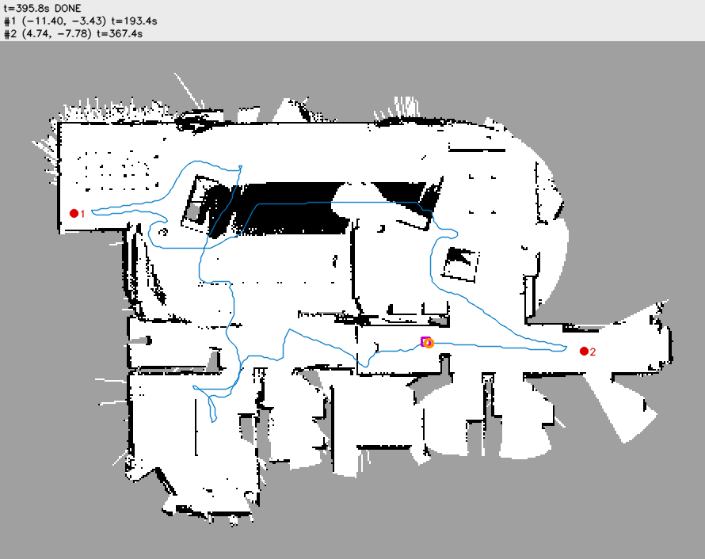
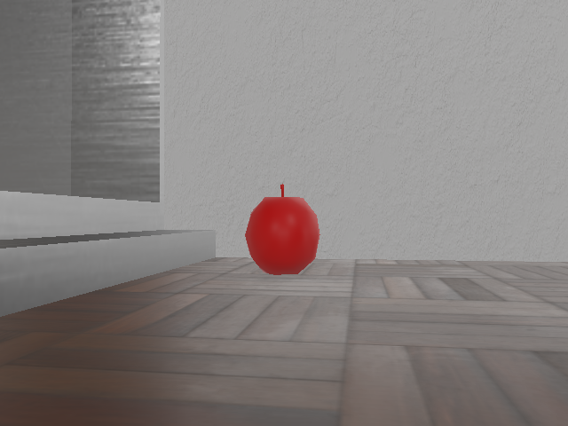
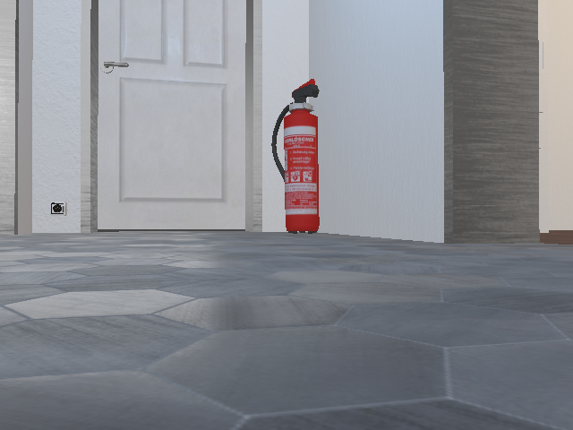

# mission 기능 설명

이 문서는 sar-robot `controllers/sar_main/sar/mission.py`에 구현한 미션 상태 머신과 모듈 통합의 동작과 검증 결과를 설명합니다. 진입점 `sar_main.py`가 모듈을 생성하고 매 step `Mission.tick()`을 호출합니다.

## 과제와의 관계

- 과제 목표는 빨간 사과 2개를 방문한 뒤 시작 지점으로 복귀하는 것입니다. mission은 이 흐름 전체를 담당합니다.
- 상태 머신은 [과제와 구현 기준](../../reference/sar-과제-구현-기준.md) 8장, `CONTEXT.md` 7장 기준입니다. 목적지가 시작 지점이므로 GO_GOAL 상태는 없습니다.
- [병합 분석](../sar-robot-병합-분석.md) 6장의 통합 범위 문제 2건을 해결했습니다.
  - 2번 나침반 미전달: INIT_SPIN에서 보정 후 `Odometry.update()`에 방향 전달
  - 5번 `Confirm` 호출 시점: YOLO를 실행한 step에서만 호출

## 동작 원리

### 처리 순서

`tick()`은 매 step 다음 순서로 처리합니다.

1. 센서 읽기: 시간, 라이다, 나침반, 엔코더
2. `Odometry.update()`. 나침반 보정이 끝났으면 보정된 방향 전달
3. `GridMap.update()`
4. `YOLO_EVERY`(4) step마다 `detect_all()` → `to_world()` → 구조 완료·제외 위치 필터 → `Confirm.update()`
5. 상태별 속도 명령 계산
6. `safety_filter()` 적용
7. `RobotIO.drive()`
8. 궤적 기록, 정체 검사, 지도 저장, 1초 주기 상태 로그

### 상태

| 상태 | 동작 | 전환 조건 |
|---|---|---|
| INIT_SPIN | `INIT_SPIN_W`(0.8 rad/s)로 제자리 회전. 나침반 원시각 표본 수집 | 나침반 누적 회전 2π → EXPLORE (대상 확정 시 APPROACH) |
| EXPLORE | 미구조 후보를 먼저, 없으면 `choose_frontier()` 목표로 `plan()` → `pure_pursuit()` | 대상 확정 → APPROACH, 프론티어 없음 → RETURN |
| APPROACH | 대상에서 `APPROACH_DIST`(0.35 m) 떨어진 점으로 이동(`V_APPROACH` 이하). 도착 후 방위각 `FACE_TOL` 이내로 정렬 | 정렬 완료 → RESCUE, 60초 초과 → 대상 제외 후 EXPLORE |
| RESCUE | 2초 정지. 위치·시각 기록, 지도·카메라 화면 저장 | 구조 수 = `TARGET_COUNT` → RETURN, 아니면 EXPLORE |
| RETURN | `plan(grid, pose, 시작점, allow_unknown=True)` 추종. `GOAL_TOL` 이내부터 직진 접근 | `RETURN_TOL`(0.12 m) 이내 → DONE |
| RECOVERY | 1초 후진, 넓은 쪽으로 1.5초 회전 | 완료 → 이전 상태 |
| DONE | 정지, 최종 지도 저장, 결과 로그 | 없음 |

공통 규칙은 다음과 같습니다.

- 남은 시간이 `RETURN_RESERVE`(150초) 미만이면 RETURN
- 4초 동안 5 cm 미만 이동이면 RECOVERY. RECOVERY 후 APPROACH로 돌아와도 접근 제한 시간은 초기화하지 않음
- 안전 필터가 3초 연속 차단하면 경로 재계획
- 프론티어 선택과 경로 계획은 `REPLAN_PERIOD`(2초) 주기와 목표 도착·변경 시점에만 실행
- 같은 프론티어 목표에 30초 안에 도달하지 못하거나 경로가 없으면 블랙리스트 등록

### 대상 2개 처리

- 구조 완료 위치와 접근 실패로 제외한 위치에서 `FOUND_EXCLUDE_RADIUS`(0.6 m) 이내 검출은 무시합니다.
- 확정한 대상이 있으면 일치 검출(`CONFIRM_MATCH_RADIUS` 이내)로 대상 위치만 갱신합니다. 나머지 검출은 미구조 후보로 저장합니다.
- EXPLORE는 후보를 프론티어보다 먼저 목표로 선택합니다. 후보 `CANDIDATE_DROP_DIST`(0.8 m)까지 접근해도 확정되지 않으면 후보를 삭제합니다.

### 나침반 보정

나침반 원시각은 $\varphi = \operatorname{atan2}(c_y, c_x)$입니다. 보정된 방향은 $\theta = s\,\varphi + o$입니다. 시작 회전 표본 $(\theta_k, \varphi_k)$에서 다음과 같이 추정합니다.

$$
s = \operatorname{sgn}\sum_k \Delta\theta_k\,\Delta\varphi_k, \qquad
o = \operatorname{wrap}(\theta_0 - s\,\varphi_0), \qquad
\text{scale} = \frac{\sum_k \lvert\Delta\theta_k\rvert}{\sum_k \lvert\Delta\varphi_k\rvert}
$$

$\theta_0$은 설정한 시작 방향(`START_THETA`)이므로 정확합니다. 처음에는 전체 표본에 오프셋을 맞추는 방식을 사용했습니다. 이 방식은 Webots에서 실패했습니다. 제자리 회전 중 오도메트리 회전량이 실제보다 10.4% 크게 측정되어(scale 1.104) 잔차가 기준을 초과했기 때문입니다. 나침반 누적 회전이 π 미만이거나 scale이 1에서 `COMPASS_SCALE_TOL`(0.5)를 초과해 벗어나면 보정하지 않고 엔코더 방향만 사용합니다.

## 인터페이스와 설정값

| 함수 | 입력 | 출력 |
|---|---|---|
| `Mission(io, odom, grid, detector, log=None)` | `RobotIO`, `Odometry`, `GridMap`, `TargetDetector`, 로그 함수 | 미션 객체. 시작점은 생성 시 `odom.pose()` |
| `Mission.tick()` | 없음 | 없음 |
| `fit_compass(samples)` | `[(오도메트리 방향, 나침반 원시각), ...]` | `(sign, offset, scale)` 또는 `None` |
| `compass_heading(vec, sign, offset)` | 나침반 벡터, 보정값 | 방향 [rad] |

| 설정값 | 값 | 의미 |
|---|---|---|
| `INIT_SPIN_W` | 0.8 rad/s | 시작 회전 속도 |
| `COMPASS_SCALE_TOL` | 0.5 | 오도메트리/나침반 회전 비율 허용 편차 |
| `REPLAN_PERIOD` | 2.0 s | 프론티어 선택·경로 재계획 주기 |
| `FRONTIER_TIMEOUT` | 30.0 s | 프론티어 목표 제한 시간 |
| `APPROACH_TIMEOUT` | 60.0 s | 대상 접근 제한 시간 |
| `RESCUE_HOLD` | 2.0 s | 구조 정지 시간 |
| `RETURN_TOL` | 0.12 m | 시작점 도착 판정 |
| `FACE_TOL`, `FACE_GAIN` | 0.1 rad, 1.5 1/s | 정면 정렬 허용 오차, 정렬 이득 |
| `CANDIDATE_DROP_DIST` | 0.8 m | 미확정 후보 삭제 거리 |
| `STUCK_TIME`, `STUCK_DIST` | 4.0 s, 0.05 m | 정체 판정 |
| `BLOCKED_TIME` | 3.0 s | 안전 필터 연속 차단 재계획 |
| `RECOVERY_BACK_TIME`, `RECOVERY_TURN_TIME` | 1.0 s, 1.5 s | 복구 동작 시간 |
| `TRAJ_STEP` | 0.10 m | 궤적 기록 간격 |

출력 파일은 `controllers/sar_main/output/`에 저장합니다.

| 파일 | 저장 시점 |
|---|---|
| `map_latest.png` | 5초 주기 |
| `map_rescue_<n>.png`, `rescue_<n>_camera.png` | n번째 구조 |
| `map_final.png` | DONE |

## 검증 결과

| 항목 | 명령·조건 | 결과 |
|---|---|---|
| pytest | 저장소 루트 `.venv/bin/python -m pytest -q` | 113 passed, 1 skipped (Intro 동기화 검사, 작업 폴더 위치 때문) |
| mission 테스트 | `tests/test_mission.py` 8개. 가짜 IO·검출기, 실제 `GridMap`·`planner`·`local_control` | 사과 2개 구조 후 시작점 0.12 m 이내 DONE, 나침반 부호·오프셋 복원, `Confirm` 호출 시점, 제외 반경, 시간 예비, 정체 복구 통과 |
| 단독 테스트 | `controllers/sar_main`에서 `python -m sar.mission` | `mission self-test ok` |
| ruff | `ruff check .`, `ruff format --check .` | 통과 |
| Webots | `worlds/sar_apartment.wbt`, `--batch --mode=fast --minimize`, macOS, Webots R2025a | 아래 표 |

Webots 실행 결과(2차, 진단 로그 추가 후)는 다음과 같습니다.

| 항목 | 결과 |
|---|---|
| 나침반 보정 | sign −1, offset 1.571 rad, 오도메트리/나침반 회전 비율 1.104 |
| 1번 구조 | t=193.4초, 실제 빨간 사과 (그림 2). 추정 위치 (−11.40, −3.43), 실제 위치 (−12.02, −3.02)와 0.74 m 차이 (오도메트리 좌표계 누적 오차 포함) |
| 오탐 대상 제외 | t=264.6초, (−5.18, −3.80) 대상 접근 60초 초과로 제외 |
| 2번 구조 | t=367.4초, **소화기 오탐** (그림 3). 추정 위치 (4.74, −7.78) |
| 복귀 | t=395.8초 DONE, 시작점 거리 0.116 m |
| 실행 속도 | 시뮬레이션 395.8초를 101초에 실행 (약 3.9배) |
| 확정 검출 출처 | 3건 모두 `source=color` (YOLO 후보 0건) |

그림 1. 2차 실행 최종 지도. 빨간 점 1·2는 구조 위치, 파란 선은 주행 궤적입니다.

그림 2. 1번 구조 시점 카메라 화면. 빨간 사과를 정면에서 확인했습니다.

그림 3. 2번 구조 시점 카메라 화면. 빨간 사과가 아닌 소화기를 대상으로 확정했습니다.

## 한계와 확인 필요 항목

| 항목 | 내용 | 담당 |
|---|---|---|
| YOLO 미검출 | 저장한 1번 구조 화면(0.5 m 거리 빨간 사과)에서도 YOLO 후보가 0건. 모든 확정이 색 분할 대체 검출 | 인지 |
| 색 분할 오탐 | 소화기 원형도 0.64~0.70, 사과 0.74~0.79. `MIN_CIRCULARITY`(0.6)로 구분 불가. 1차 실행의 (−5.18, −3.80) 대상도 색 분할 확정 | 인지 |
| 두 번째 빨간 사과 | (−5.34, −10.54) 사과를 찾기 전에 오탐으로 구조 수 2개 충족 | 인지 오탐 해결 후 재검증 |
| 위치 추정 오차 | 1번 구조 추정 위치가 실제와 0.74 m 차이. 구조 판정은 카메라 정면 확인이라 영향 없음. 위치 기록·지도 표시 정확도 개선 필요 | 행동 |
| README | 제출용 실행 절차 미작성. 인식 오탐 해결 후 작성 | 통합 |

## 관련 자료

- 구현: sar-robot `controllers/sar_main/sar/mission.py`, `sar_main.py`, `tests/test_mission.py`
- 상태 머신 원본: [과제와 구현 기준](../../reference/sar-과제-구현-기준.md) 8장
- 연결 모듈: [grid_map](grid_map.md), [planner](planner.md), [perception](perception.md), [viz](viz.md)
- 검증 월드: sar-robot `worlds/sar_apartment.wbt` (apartment.wbt에 `sar_main` 컨트롤러 지정)
