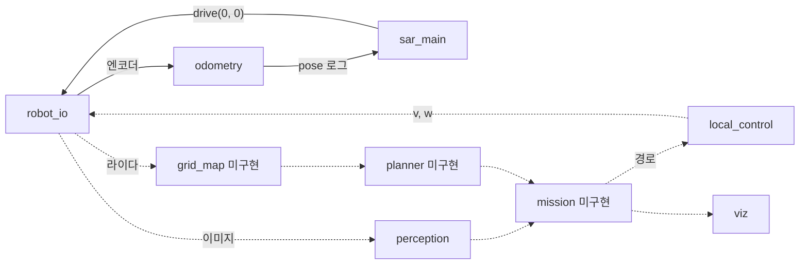

# sar-robot 병합 내용 분석

2026-09-30 기준 sar-robot `main`(`71dc415`)에 병합된 PR 6건의 구현 범위, 모듈 동작, 검증 결과, 과제 대비 남은 작업, 확인된 문제를 분석한 문서입니다. 분석 근거는 코드 확인, 테스트 실행, 계산 재현입니다. 과제 요구사항과 인터페이스 기준은 [과제와 구현 기준](../reference/sar-과제-구현-기준.md)입니다.

## 1. 요약

- 인지(`perception`, `viz`, `hsv_tuner`), 행동(`odometry`, `local_control`), 통합 기반(`robot_io`, `config`)이 병합되었습니다.
- 미션 상태 머신(`mission`), 점유 격자(`grid_map`), 경로 계획(`planner`)은 구현 전입니다. 현재 컨트롤러는 정지 상태에서 위치 로그만 출력합니다.
- 과제 흐름(탐색 → 사과 2개 방문 → 복귀) 중 Webots에서 동작하는 단계는 아직 없습니다.
- pytest 58개와 ruff 검사는 통과합니다. Webots에서 확인한 동작은 `sar_main` 기동과 오도메트리 로그뿐입니다.
- 확인된 문제는 9건입니다. 우선 수정 대상은 경로 추종이 지나온 경로점을 목표로 선택하는 문제(6.1절 1번)입니다.

## 2. 병합 이력

| PR | 병합 시각 (KST) | 작성자 | 역할 | 내용 |
|---|---|---|---|---|
| [#1](https://github.com/Tech-Week-2026-KimEPark/sar-robot/pull/1) | 15:41 | taehun2123 | 통합 | Webots 에셋 다운로드 실패, 컨트롤러 Python 경로 오류 수정 |
| [#3](https://github.com/Tech-Week-2026-KimEPark/sar-robot/pull/3) | 15:58 | taehun2123 | 통합 | Intro 과정 환경 이식, Python 3.10·패키지 버전 고정, Intro 실습 파일 복사 |
| [#4](https://github.com/Tech-Week-2026-KimEPark/sar-robot/pull/4) | 16:18 | taehun2123 | 통합 | 월드 PROTO·에셋 재귀 사전 캐시, Intro 실습 파일 동기화 검사 |
| [#5](https://github.com/Tech-Week-2026-KimEPark/sar-robot/pull/5) | 16:46 | taehun2123 | 통합·행동 | `CONTEXT.md` 파일 구조 적용, `RobotIO`·`Odometry` 인터페이스 변경 |
| [#6](https://github.com/Tech-Week-2026-KimEPark/sar-robot/pull/6) | 16:53 | kimchunsik17 | 인지 | 빨간 사과 검출·위치 추정, 지도 시각화, HSV 튜닝 컨트롤러 |
| [#7](https://github.com/Tech-Week-2026-KimEPark/sar-robot/pull/7) | 16:59 | T2N-25 | 행동 | pure pursuit 경로 추종, 라이다 안전 필터 |

#2는 #1과 같은 브랜치의 중복 PR이며 병합 없이 닫혔습니다. #6과 #7은 #5 이전 구조에서 작성되어 #5 병합 후 충돌했습니다. #6은 `main` 병합 커밋으로 해결했습니다. #7은 작성자가 최신 `main` 기준으로 다시 push한 뒤 충돌 없이 병합되었습니다.

## 3. 모듈 구현 현황

`sar/` 모듈의 경로는 `controllers/sar_main/sar/`입니다. 병합 PR은 2장에 있습니다.

| 모듈 | 담당 | 줄 수 | 상태 | 테스트 |
|---|---|---|---|---|
| `sar_main.py` | 통합 | 31 | 기동·로그만 | 없음 |
| `robot_io.py` | 통합 | 91 | 구현 | pytest 3개, 단독 통과 |
| `config.py` | 통합 | 92 | 구현 | 없음 |
| `odometry.py` | 행동 | 75 | 구현 | pytest 8개, 단독 통과 |
| `local_control.py` | 행동 | 106 | 구현 | pytest 11개, 단독 통과 |
| `perception.py` | 인지 | 276 | 구현 | pytest 24개, 단독 통과 |
| `viz.py` | 인지 | 142 | 구현 | pytest 6개, 단독 통과 |
| `hsv_tuner.py` (`controllers/hsv_tuner/`) | 인지 | 129 | 구현 | 없음 |
| `mission.py` | 통합 | 없음 | 미구현 | 없음 |
| `grid_map.py` | 계획 | 없음 | 미구현 | 없음 |
| `planner.py` | 계획 | 없음 | 미구현 | 없음 |

pytest는 위 모듈 52개와 에셋 캐시 스크립트 5개, Intro 동기화 검사 1개를 포함해 58개입니다. 계획 역할의 병합 PR은 아직 없습니다.

## 4. 실행 흐름 현황

현재 `sar_main.py`는 매 step마다 엔코더 값으로 오도메트리를 갱신하고 `drive(0, 0)`을 전송합니다. 1초마다 pose와 라이다 정면 거리를 출력합니다. 인지·행동 모듈은 구현되었지만 미션 루프에 연결되지 않았습니다.



실선은 현재 연결된 흐름, 점선은 미션 구현 후 연결할 흐름입니다. 나침반 값은 `RobotIO.compass()`로 읽을 수 있지만 `Odometry.update()`에 전달하지 않습니다.

## 5. 모듈별 분석

### 5.1 robot_io

- `controller` 모듈을 `RobotIO` 생성 시점에 import합니다. 따라서 `wheel_speeds()`는 Webots 없이 테스트됩니다.
- `wheel_speeds(v, w)`는 바퀴 각속도가 `MAX_WHEEL_SPEED`(6.67 rad/s)를 초과하면 좌우 비율을 유지하며 축소합니다. 회전 방향이 유지됩니다.
- 라이다, 카메라, 나침반은 월드에 없으면 `None`을 반환합니다. 연습 월드의 TurtleBot3Burger PROTO에는 나침반이 기본 포함되어 있습니다.

### 5.2 odometry

- 바퀴 이동 거리로 원호 적분을 수행합니다. 회전각이 $10^{-9}$ rad 미만이면 직선으로 적분합니다.
- 방향 칼만 필터는 매 호출마다 분산에 $Q = 0.01^2$을 더합니다. 나침반 방향이 주어질 때만 갱신 단계를 수행합니다.
- 현재 컨트롤러는 나침반 값을 전달하지 않습니다. 나침반 갱신 없이 제한 시간 900초를 주행하면 분산은 $14{,}062 \times 10^{-4} \approx 1.41\ \text{rad}^2$($\sigma \approx 1.19$ rad)까지 증가합니다. 나침반 벡터를 방향으로 변환하고 부호·오프셋을 보정하는 작업은 미션의 INIT_SPIN 단계 담당입니다.

### 5.3 perception

검출 순서는 다음과 같습니다.

| 단계 | 처리 | 설정값 |
|---|---|---|
| 1 | YOLO11n으로 apple·orange·sports ball 후보 검출 | `YOLO_CLASSES`, `YOLO_CONF` |
| 2 | 상자 안 빨강 픽셀 비율이 하한 이상인 후보만 선택 | `HSV_RANGES`, `COLOR_RATIO_MIN` |
| 3 | 2단계 후보가 없으면 색 분할(면적·원형도)로 대체 검출 | `MIN_BLOB_AREA`, `MIN_CIRCULARITY` |
| 4 | 중심이 화면 가운데선보다 20 px 이상 위인 후보 제외 | `HORIZON_MARGIN` |
| 5 | 상자 긴 변으로 거리, 중심 가로 좌표로 방위각 계산 | `TARGET_DIAMETER`, `CAMERA_FOV` |
| 6 | 연속 4회 검출 시 확정, 거리 가중 평균 위치 | `CONFIRM_FRAMES`, `CONFIRM_MATCH_RADIUS` |

거리는 $d = f D / (w \cos\beta)$로 계산합니다. 과제 문서의 $d \approx f D / w$(광축 방향 깊이)를 방위각으로 보정한 식입니다. 초점거리는 $f \approx 554.3$ px입니다. 상자 폭 1 px 오차에 따른 거리 오차는 다음과 같습니다.

| 거리 | 상자 폭 | 1 px 과소 측정 시 거리 오차 |
|---|---|---|
| 0.35 m | 150.4 px | +0.002 m (0.7%) |
| 1 m | 52.7 px | +0.019 m (1.9%) |
| 2 m | 26.3 px | +0.079 m (3.9%) |
| 3 m | 17.6 px | +0.181 m (6.0%) |
| 5 m | 10.5 px | +0.525 m (10.5%) |

3 m 이상에서는 오차가 0.18 m를 초과합니다. 연속 확인의 거리 가중 평균이 먼 관측의 영향을 줄이는 설계와 일치합니다.

높이 제외 조건(`HORIZON_MARGIN` 20 px)은 월드 치수로 확인했습니다. 카메라 높이는 extensionSlot 0.153 m와 카메라 오프셋 −0.08 m의 합인 0.073 m입니다. 바닥 사과 중심 높이는 0.05 m입니다.

| 대상 | 높이 차 | 1 m | 3 m | 10 m |
|---|---|---|---|---|
| 바닥 사과 | 카메라보다 0.023 m 아래 | 중심보다 12.7 px 아래 | 4.2 px 아래 | 1.3 px 아래 |
| 식탁 위 Apple 모델 (z ≈ 0.83) | 카메라보다 0.757 m 위 | 419 px 위 (화면 밖) | 139.8 px 위 | 41.9 px 위 |

바닥 사과는 모든 거리에서 가운데선 아래에 있으므로 제외되지 않습니다. 식탁 위 모델은 21 m 이내에서 20 px 이상 위에 있으므로 연습 맵 전체에서 제외됩니다. 카메라는 로봇 중심보다 0.02 m 앞에 있습니다. `to_world()`는 로봇 중심을 카메라 위치로 사용하므로 위치 추정에 약 0.02 m의 편향이 있습니다.

### 5.4 viz

- 공개 격자값(−1, 0, 1)을 받아 확인된 영역과 여백 20칸만 잘라 그립니다. row 0이 y 최소이므로 상하를 뒤집어 +y가 위쪽이 되게 표시합니다.
- 주행 궤적, 계획 경로, 시작점, 구조 위치 번호·시각, 현재 pose를 표시합니다.
- 격자는 `grid_map`의 공개값에 의존합니다. `grid_map` 구현 전에는 실제 지도를 렌더링할 수 없습니다.

### 5.5 local_control

- `pure_pursuit()`: 경로 끝점이 `GOAL_TOL`(0.15 m) 이내면 도착 처리합니다. look-ahead 점의 방위각이 55°를 초과하면 제자리 회전하고, 그 외에는 곡률 $\kappa = 2 y_{\text{LA}} / L_d^2$로 각속도를 계산합니다. 직진 속도는 항상 `V_MAX`입니다.
- `safety_filter()`: 정면 ±25° 범위의 라이다 최솟값이 `STOP_DIST`(0.20 m) 미만이면 전진 속도를 0으로 바꿉니다. 회전 속도는 그대로 유지합니다.

### 5.6 hsv_tuner

- `controllers/sar_main`을 import 경로에 추가해 `sar` 패키지를 사용합니다. `TargetDetector`와 같은 검출 경로로 결과를 표시하므로 튜닝 결과와 실제 검출이 일치합니다.
- 키보드 조종은 `RobotIO.drive(v, w)`를 사용합니다. 조작 절차는 sar-robot `docs/human/how-to/hsv-tuning.md`에 있습니다.

## 6. 확인된 문제

| 번호 | 문제 | 우선순위 |
|---|---|---|
| 1 | 경로 추종이 지나온 경로점을 목표로 선택 | 높음 |
| 2 | 나침반 값을 오도메트리에 전달하지 않음 | 높음 |
| 3 | 안전 필터 검사 범위가 정지 거리에서 로봇 폭보다 좁음 | 중간 |
| 4 | 후진 시 안전 필터 미적용 | 중간 |
| 5 | 연속 확인이 미검출 1회에 초기화 | 중간 |
| 6 | 라이다 최소 거리 미만 값의 반환 형식 미확인 | 확인 필요 |
| 7 | 사과 지름 설정값과 PROTO 치수 불일치 가능성 | 확인 필요 |
| 8 | YOLO 대상이 있으면 색 분할 대체 검출 미실행 | 낮음 |
| 9 | 튜닝 각도 2개를 모듈 상수로 정의 | 낮음 |

### 6.1 문제별 내용

1. **경로 추종이 지나온 경로점을 목표로 선택**
   - 위치: `local_control._lookahead_point`
   - 내용: 경로 첫 점부터 검색해 로봇에서 look-ahead 이상 떨어진 첫 점을 선택함. 로봇 뒤의 점도 선택 대상임
   - 영향: 재계획 주기 사이 제자리 회전 반복 (6.2절 재현)
   - 권장 조치: 로봇과 가장 가까운 경로점 이후부터 검색
2. **나침반 값을 오도메트리에 전달하지 않음**
   - 위치: `sar_main.py`, `mission` (미구현)
   - 영향: 방향 오차 누적으로 위치 오차 증가 (5.2절)
   - 권장 조치: INIT_SPIN에서 나침반 부호·오프셋 보정 후 `Odometry.update()`에 방향 [rad] 전달
3. **안전 필터 검사 범위가 정지 거리에서 로봇 폭보다 좁음**
   - 위치: `local_control.safety_filter`
   - 내용: 정면 ±25° 범위의 좌우 반폭이 0.20 m 거리에서 0.093 m임. 로봇 반지름은 0.105 m (6.3절)
   - 영향: 로봇 모서리 방향 장애물과 충돌 가능
   - 권장 조치: 검사 반각 39.5° 이상으로 확대하거나 빔별 좌우 거리 검사
4. **후진 시 안전 필터 미적용**
   - 위치: `local_control.safety_filter`
   - 내용: `v ≤ 0`이면 검사 없이 통과함
   - 영향: RECOVERY 후진 중 후방 충돌 가능
   - 권장 조치: 후진 시 라이다 후방 범위(인덱스 0 주변) 검사
5. **연속 확인이 미검출 1회에 초기화**
   - 위치: `perception.Confirm`
   - 내용: `seen=False` 1회에 관측 기록 전체를 초기화함. YOLO는 4 step마다 실행하므로 확정까지 최소 16 step(약 1.0초)이 필요함
   - 영향: 추론하지 않은 step에 `seen=False`를 전달하면 확정 불가
   - 권장 조치: 미션에서 YOLO를 실행한 step에만 `Confirm.update()` 호출
6. **라이다 최소 거리 미만 값의 반환 형식 미확인**
   - 위치: `local_control.safety_filter`
   - 내용: LDS-01 최소 거리는 0.12 m임. 이보다 가까운 물체의 반환값을 확인하지 않음
   - 영향: `inf`로 반환되면 근접 장애물을 차단하지 못함
   - 권장 조치: Webots에서 벽에 붙인 상태의 반환값 확인
7. **사과 지름 설정값과 PROTO 치수 불일치 가능성**
   - 위치: `config.TARGET_DIAMETER`
   - 내용: 설정값은 0.095 m임. RedApple PROTO 충돌 구(bounding sphere) 반지름은 0.05 m(지름 0.10 m)임
   - 영향: 실제 표시 지름이 0.10 m면 거리를 5% 과소 추정
   - 권장 조치: 메시 지름 또는 1 m 거리 상자 폭 실측 후 값 보정
8. **YOLO 대상이 있으면 색 분할 대체 검출 미실행**
   - 위치: `perception.detect_all`
   - 내용: YOLO 대상이 1개라도 있으면 색 분할을 실행하지 않음
   - 영향: 같은 화면의 두 번째 사과를 YOLO가 놓치면 목록에서 누락. 과제 문서 8.2절 후보 저장 규칙의 효과 감소
   - 권장 조치: YOLO 상자와 겹치지 않는 색 분할 결과를 목록에 추가
9. **튜닝 각도 2개를 모듈 상수로 정의**
   - 위치: `local_control`
   - 내용: `_PIVOT_ANGLE`(55°), `_FRONT_HALF_ANGLE`(25°)을 모듈 안에 정의함
   - 영향: "숫자 상수는 `config.py`에만 정의" 규칙과 불일치. 현장 튜닝 시 수정 위치가 분산됨
   - 권장 조치: `config.py`로 이동

### 6.2 문제 1 재현

로봇이 경로 `(0, 0) → (2, 0)` 위를 0.5 m 진행한 상태에서 다시 계산하면 지나온 시작점이 목표로 선택됩니다.

```python
path = [(0, 0), (0.25, 0), (0.5, 0), (0.75, 0), (1.0, 0), (2.0, 0)]
pose = (0.5, 0.0, 0.0)  # 경로 위 0.5 m 진행, 정면 +x
_lookahead_point(pose, path, 0.35)  # (0, 0): 로봇 뒤 0.5 m
pure_pursuit(pose, path)            # (0.0, 1.8, False): 전진 없이 제자리 회전
```

경로 재계획 주기 2초 동안 로봇은 최대 $0.18 \times 2 = 0.36$ m 진행합니다. 이 거리는 look-ahead 0.35 m보다 길어서 실제 주행에서도 발생합니다.

### 6.3 문제 3 계산

정지 거리 $d_s$에서 검사 범위의 좌우 반폭은 다음과 같습니다.

$$
d_s \tan 25^\circ = 0.20 \times 0.466 = 0.093\ \text{m} < r_{\text{robot}} = 0.105\ \text{m}
$$

로봇 반지름에 `SAFETY_MARGIN`(0.06 m)을 더한 폭을 포함하려면 검사 반각이 $\arctan(0.165 / 0.20) \approx 39.5^\circ$ 이상이어야 합니다.

## 7. 검증 결과

| 항목 | 결과 | 비고 |
|---|---|---|
| pytest | 57 passed, 1 skipped | 건너뛴 1개는 Intro 동기화 검사. 형제 폴더에 Intro 저장소가 있으면 실행 |
| ruff | `ruff check`, `ruff format --check` 통과 | 33개 파일 |
| 단독 테스트 | `odometry`, `robot_io`, `local_control`, `perception`, `viz` 통과 | `controllers/sar_main`에서 `python -m sar.<모듈>` |
| Webots | `sar_main` 기동, pose·라이다 로그 확인 | `worlds/sar_dev.wbt`, #5에서 확인 |
| Webots 미확인 | `perception` 실제 조명 검출, `local_control` 주행, `hsv_tuner` 화면 | 미션 미구현으로 루프에 연결되지 않음 |

pytest, ruff, 단독 테스트는 `71dc415`에서 macOS, Python 3.10.21로 실행했습니다. Webots 확인은 #5 시점 코드에서 Webots R2025a로 실행했습니다.

## 8. 과제 대비 남은 작업

| 과제 요소 | 필요한 모듈 | 현재 상태 | 담당 |
|---|---|---|---|
| 시작 회전·나침반 보정 | `mission` INIT_SPIN | 미구현 | 통합 |
| 미지 환경 탐색 | `grid_map`, `planner`, `mission` EXPLORE | 미구현 | 계획, 통합 |
| 빨간 사과 인식·위치 확정 | `perception` | 구현, Webots 미확인 | 인지 |
| 사과 앞 0.35 m 접근 | `mission` APPROACH, `local_control` | 추종·안전 필터만 구현 | 통합, 행동 |
| 사과 2개 구분 | `perception.is_excluded`, `mission` | 판정 함수만 구현 | 통합 |
| 시작 지점 복귀 | `planner`, `mission` RETURN | 미구현 | 계획, 통합 |
| 지도 시각화 저장 | `viz`, `mission` | 그림 함수만 구현 | 인지, 통합 |
| 제출용 README | README | 개발 환경 안내만 있음 | 통합 |

## 9. 권장 작업 순서

1. 행동: 6.1절 1번 look-ahead 검색 시작점을 수정하십시오. 3·4번 안전 필터 범위도 함께 수정하십시오.
2. 계획: `grid_map`과 `planner`를 [과제와 구현 기준](../reference/sar-과제-구현-기준.md) 7.2절 형식으로 구현하십시오. `viz.render_map()`이 공개 격자값(−1, 0, 1)을 사용합니다.
3. 통합: `mission` 상태 머신을 구현하고 INIT_SPIN에서 나침반을 보정하십시오. `Confirm.update()`는 YOLO를 실행한 step에서만 호출하십시오.
4. 인지: `apartment.wbt`에서 1 m, 2 m, 3 m 거리의 검출 결과와 추정 거리를 측정하십시오. 6.1절 7번 사과 지름을 확인하십시오.
5. 통합: 제출용 README를 작성하고 [과제와 구현 기준](../reference/sar-과제-구현-기준.md) 3.2절 재현성 검증을 수행하십시오.

## 관련 자료

- 과제 요구사항과 인터페이스: [과제와 구현 기준](../reference/sar-과제-구현-기준.md)
- 모듈 구현 상태: sar-robot [모듈 인터페이스](https://github.com/Tech-Week-2026-KimEPark/sar-robot/blob/main/docs/human/reference/interfaces.md)
- 병합 PR: sar-robot [#5](https://github.com/Tech-Week-2026-KimEPark/sar-robot/pull/5), [#6](https://github.com/Tech-Week-2026-KimEPark/sar-robot/pull/6), [#7](https://github.com/Tech-Week-2026-KimEPark/sar-robot/pull/7)
