# SAR 로봇 시스템 설계서

이 문서는 sar-robot의 인지·계획·행동·통합 설계와 설계 근거를 수치로 설명합니다. 모든 수치는 측정 조건과 재현 명령을 함께 기재합니다.

| 항목 | 내용 |
|---|---|
| 프로젝트 | 부산대 TECH WEEK 2026 Search & Rescue, sar-robot |
| 문서 | SAR 로봇 시스템 설계서 |
| 작성자 | 김태훈 (통합) |
| 검토자 | 박상원 (계획), 이온규 (인지), 김규민 (행동) |
| 작성일 | 2026-09-30 |
| 버전 | 1.0 |
| 승인 상태 | 검토 중 (팀 리뷰 대기) |
| 기준 코드 | sar-robot `main` `199349b`. 측정 도구 sar-robot `test/design-eval` |

## 1. 개요

TurtleBot3 Burger가 지도와 위치 정보 없이 apartment 월드에서 빨간 사과 2개에 접근한 뒤 시작점으로 복귀하는 시스템입니다. 통합 모듈(`mission`)이 64 ms step마다 인지(`perception`), 계획(`grid_map`, `planner`), 행동(`odometry`, `local_control`)을 순서대로 호출합니다. 설계 근거는 Webots 측정 실행 4회와 기록 재계산·시뮬레이션 실험 20종으로 수치화했습니다.

| 조건 | 구조 | 소요 시간 | 실제 복귀 오차 |
|---|---|---|---|
| 현재 main (오도메트리) | 0 / 2 | 495.3 s | 2.079 m |
| 위치 오차 제거 + `CONFIRM_FRAMES=3` | 2 / 2 | 374.9 s | 0.114 m |

두 조건의 차이는 위치 추정(카펫 경계 바퀴 공회전)과 연속 확인 프레임 수에서 발생합니다. 7.6절에 개선 우선순위를 기재합니다.

## 2. 목표

### 2.1 해결할 문제

| 문제 | 제약 | 담당 모듈 |
|---|---|---|
| 위치 추정 | GPS·Supervisor 사용 금지, 시작 pose만 제공 | `odometry`, `mission` |
| 지도 작성 | 사전 지도 없음, 12.4 × 13.1 m, 방 다수 | `grid_map` |
| 탐색·경로 | 대상 위치 모름, 제한 시간 900 s | `planner`, `mission` |
| 대상 인식 | 다른 색 사과 5개, 빨간 방해 물체(소화기) | `perception` |
| 충돌 방지 | 라이다 높이 아래 물체, 보행자 0.2 m/s | `local_control` |

### 2.2 성공 기준

R1~R4는 6.1절의 측정 실행입니다.

| 기준 | 목표값 | R1 현재 main | R4 개선 조건 |
|---|---|---|---|
| 빨간 사과 구조 | 2개 | 0개 | 2개 |
| 오구조 (빨간 사과 외 대상) | 0건 | 0건 | 0건 |
| 실제 복귀 오차 | 0.12 m 이하 | 2.079 m | 0.114 m |
| 소요 시간 | 900 s 이하 | 495.3 s | 374.9 s |
| 몸체 접촉 | 0 step | 7 step | 0 step |
| 지도 저장 | 주기·구조·종료 시점 | 저장 | 저장 |

R1의 추정 복귀 오차는 0.114 m입니다. 로봇은 추정 위치 기준으로 복귀를 판정하므로 실제 오차 2.079 m를 인지하지 못합니다.

## 3. 범위

### 3.1 포함

| 역할 | 모듈 | 기능 |
|---|---|---|
| 통합 | `robot_io`, `mission`, `config`, `sar_main.py` | Webots 장치 접근, 상태 머신, 설정값, 진입점 |
| 인지 | `perception`, `viz`, `controllers/hsv_tuner/` | 빨간 사과 검출·위치 추정, 지도 이미지, HSV 튜닝 |
| 계획 | `grid_map`, `planner` | 점유 격자, 프론티어, A\*·다익스트라 경로 |
| 행동 | `odometry`, `local_control` | 엔코더 오도메트리·방향 칼만 필터, 경로 추종·안전 필터 |

### 3.2 제외

| 항목 | 제외 이유 | 근거 수치 |
|---|---|---|
| GPS, Supervisor | 대회 규칙. 측정 도구(`sar_eval`)에서만 사용 | 해당 없음 |
| 파티클 필터 (MCL) | 대회 3시간 안에 구현·튜닝 불가 | 해당 없음 |
| 스캔 매칭 | 도입 기준 0.3 m 미만 (#9 단거리 측정 0.139 m) | 전체 주행 측정 1.965 m로 기준 초과. 7.6절 재검토 대상 |
| GO_GOAL 상태 | 목적지가 시작점 | 해당 없음 |
| 창의성 기능 | 별도 설계 문서 대상 | 해당 없음 |
| 제출 README | 완주 확인 후 작성 | R1 구조 0개 |

## 4. 배경 및 맥락

### 4.1 대회·환경 조건

| 항목 | 값 |
|---|---|
| 월드 | apartment.wbt, x −12.4 ~ 0, y −13.1 ~ 0 m |
| 시작 pose | (−0.3, −7.5, π) |
| 빨간 사과 | (−12.02, −3.02), (−5.34, −10.54). 코드 입력 금지, 측정 판정에만 사용 |
| step | `basicTimeStep` 64 ms |
| 실행 환경 | Webots R2025a, Python 3.10, YOLO11n (ultralytics 8.4.166) |

### 4.2 센서 제약

| 센서 | 제약 | 설계 반영 |
|---|---|---|
| 라이다 LDS-01 | 360빔, 0.12 ~ 3.5 m, 0.12 m 미만 `inf`. 높이 약 0.17 m 단면만 측정 | 사과·카펫 경계 미검출. 사과 거리는 카메라로 추정 |
| 카메라 | 640 × 480, 수평 화각 60° | 거리 $d = fD / (w\cos\beta)$ |
| 나침반 | 원시각 규약이 예제마다 다름. 실측 잡음 σ = 0.00026 rad | 시작 회전에서 부호·오프셋 자동 추정 |
| 휠 엔코더 | 제자리 회전량 10.4% 과대 측정 (회전 비율 1.104) | 회전 스케일 보정 (#16) |

### 4.3 결정 이력

| PR | 결정 | 근거 |
|---|---|---|
| #5 | `controllers/sar_main/sar/` 패키지 구조 | 설치 없이 import, 컨트롤러 폴더 1개 제출 |
| #6, #10 | YOLO + HSV 색 비율 검출, 연속 확인 4프레임 | 색만 다른 사과 5개 |
| #7, #11 | pure pursuit, 안전 필터 반폭 39.5° | 25°에서 측면 사각지대 (C3) |
| #9 | 라이다 0.12 m 미만 `inf` 확인, 스캔 매칭 미도입 | 단거리 위치 오차 0.139 m |
| #12, #15 | log-odds 격자, A\*, 다익스트라 프론티어, 계획 캐시 | P2, P6 |
| #13 | 상태 머신, 나침반 기준 방향 보정 | M1 |
| #16 | 회전 스케일 보정 | L1 |
| #17 | 색 분할 형태 조건 강화, 클래스 무관 NMS | V1 |

## 5. 시스템 설계 및 아키텍처

### 5.1 구성 요소

| 계층 | 모듈 | 입력 | 출력 |
|---|---|---|---|
| 장치 | `robot_io` | Webots 장치 | 엔코더, 나침반, 라이다, BGR 이미지 / 바퀴 속도 |
| 행동 | `odometry` | 엔코더, 보정된 나침반 방향 | pose $(x, y, \theta)$ |
| 계획 | `grid_map` | pose, 라이다 거리 | log-odds 격자, 프론티어 |
| 인지 | `perception` | BGR 이미지, pose | 대상 검출, 월드 좌표, 확정 여부 |
| 계획 | `planner` | 격자, 시작·목표 | 경로 `[(x, y), ...]` |
| 행동 | `local_control` | pose, 경로, 라이다 거리 | $(v, \omega)$, 차단 여부 |
| 통합 | `mission` | 위 모듈 전체 | 상태 전환, 구조 기록, 지도 이미지 |

### 5.2 데이터 흐름

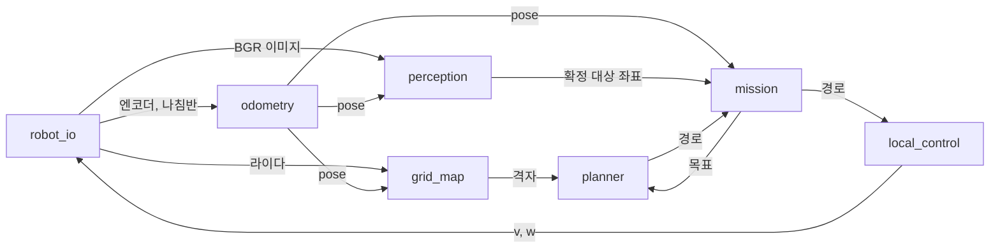

### 5.3 1 step 처리 순서

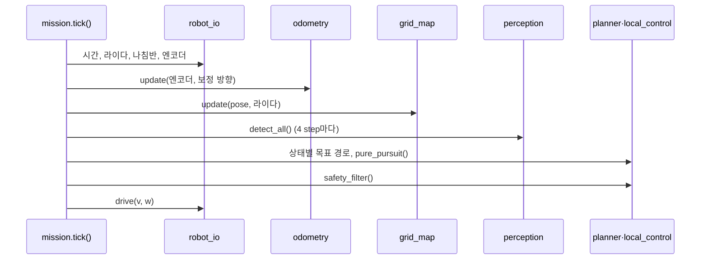

### 5.4 상태 머신

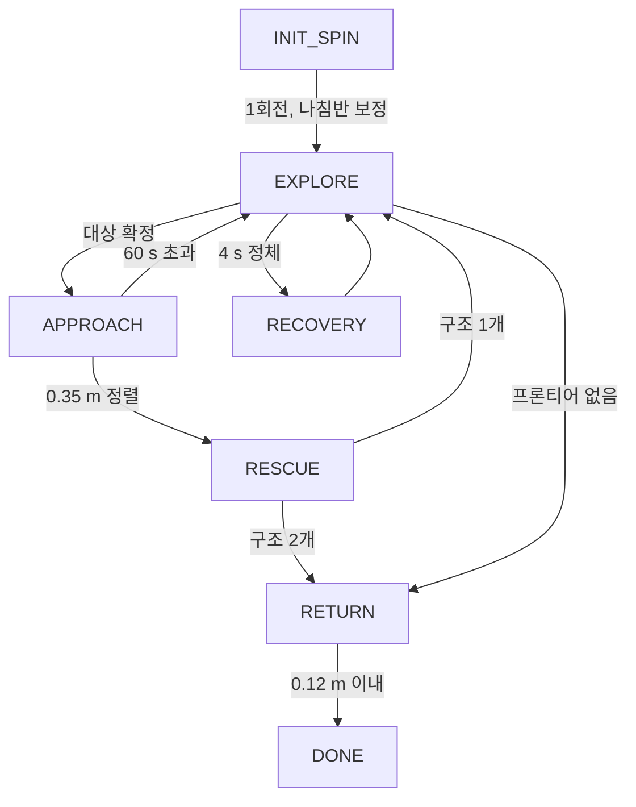

### 5.5 기술 선택 근거 요약

| 영역 (절) | 선택 / 비교 대안 | 핵심 수치 |
|---|---|---|
| 방향 추정 (6.3) | 엔코더 + 나침반 1차원 KF / 엔코더만, 나침반 직접 | R1 최종 위치 오차 7.608 → 1.965 m |
| 나침반 보정 (6.8) | 기준 방향 / 전체 잔차 RMS | 성공 회전 비율 0.99 ~ 1.01 → 0.80 ~ 1.30 (σ = 0) |
| 지도 (6.5) | log-odds 상·하한 고정 / 상·하한 없음 | 10 s 점유 칸 복귀 22.5 → 0.51 s |
| 경로 (6.6) | A\* / 다익스트라 | 계산 81.0 → 18.7 ms, 도달 칸 −88% |
| 벽 비용 (6.6) | 2.0 / 0 | 벽 최소 거리 0.011 → 0.139 m, 경로 +5% |
| 탐색 (6.6) | $N/d$ / 최근접, $N^2/d$ | 90% 확인 400 s / 미달성, 481 s |
| 경로 추종 (6.4) | 55° 제자리 회전 / 없음 | 역방향 출발 시간 −8 ~ −12%, 사과 2 경로 벽 거리 0.02 → 0.12 m |
| 안전 필터 (6.4) | 반폭 39.5° / 25° | 충돌 조건 11 / 41 → 0 / 41 |
| 인식 (6.7) | 색 비율 + 형태 조건 / 없음, #17 이전 | 오검출 17.80, 1.97 → 0.03건/100프레임 |
| 연속 확인 (6.7) | 4프레임 / 1, 2, 3, 6 | 3프레임: 사과 2개 확정, 오확정 0건 |
| YOLO 주기 (6.8) | 4 step / 1, 2, 8 | step당 계산 21.9 → 6.4 ms |

## 6. 세부 설계와 정량 검증

### 6.1 검증 방법

| 기호 | 데이터 | 조건 | 사용 실험 |
|---|---|---|---|
| R1 | Webots `SAR_EVAL_MODE=mission` | 현재 코드 | L, L2, V, M5 |
| R2 | Webots `SAR_EVAL_MODE=truth` | 오도메트리 대신 실제 pose 입력 | L, V, M5, 기준 지도 |
| R3 | R1 + `CONFIRM_FRAMES=3` | 연속 확인 3프레임 | M5 |
| R4 | R2 + `CONFIRM_FRAMES=3` | 위치 오차 제거 + 3프레임 | M5 |
| S | 기준 지도 운동학 시뮬레이션 | 오차 없는 pose, 64 ms 적분 | P2 ~ P6, C1, C2 |
| Y | 합성 입력 | 모듈 함수 직접 실행 | P1, C3, M1 |

- 측정 월드는 `worlds/sar_apartment_eval.wbt`입니다. `sar_apartment.wbt`와 로봇 `supervisor`·`controller` 필드만 다릅니다.
- 기준 지도는 R2 라이다와 실제 pose로 작성한 `GridMap`입니다. 확인 면적은 110.4 m²입니다.
- Webots 실행은 결정적입니다. R1과 R3의 7755 step 실제 pose 차이는 0.0 m입니다. R2와 R4는 R4가 사과 1을 확정한 153.728 s 전까지 차이가 0.0 m입니다.
- 도구 설명은 [sar_eval 기능 설명](features/sar_eval.md)에 있습니다.

```bash
SAR_EVAL_MODE=truth SAR_EVAL_SET=CONFIRM_FRAMES=3 /Applications/Webots.app/Contents/MacOS/webots --batch --mode=fast --minimize --stdout --stderr --port=1297 worlds/sar_apartment_eval.wbt
.venv/bin/python scripts/design_eval.py
```

### 6.2 공통 데이터 모델

| 데이터 | 형식 | 규칙 |
|---|---|---|
| 월드 좌표 | `(x, y)` [m] | Webots 월드 좌표. 코드 입력은 시작 pose만 |
| pose | `(x, y, theta)` | $\theta \in [-\pi, \pi]$, 반시계 +. `odometry.wrap()`으로 정리 |
| 속도 명령 | `(v, w)` | [m/s], [rad/s]. `wheel_speeds()`에서 최대 6.67 rad/s 비율 축소 |
| 라이다 거리 | `list[float]` 360개 | 인덱스 0 뒤, 90 왼쪽, 180 정면, 270 오른쪽 |
| 격자 | `logodds` float32 640 × 640, `seen` bool | 0.05 m 해상도, 시작점 중심 32 m. `row` ↔ y, `col` ↔ x |
| 공개 격자 | int8 | −1 모름, 0 빈칸, 1 장애물 |
| 검출 | `dict` | `cx, cy, w, h, conf, cls, color, dist, bearing, source` |
| 경로 | `list[(x, y)]` | 점 간격 0.10 m 이하, 첫 점 = 시작 좌표 |
| 구조 기록 | `(x, y, t)` | 추정 좌표와 시뮬레이션 시간 |
| 출력 파일 | PNG | `map_latest.png` 5 s 주기, `map_rescue_<n>.png`, `rescue_<n>_camera.png`, `map_final.png` |

### 6.3 행동: 위치 추정

| 함수 | 입력 | 출력 |
|---|---|---|
| `Odometry(x, y, theta)` | 시작 pose | 추정기 |
| `Odometry.update(enc_l, enc_r, compass=None)` | 누적 바퀴 회전각 [rad], 보정 방향 | 없음 |
| `Odometry.set_wheel_separation_scale(scale)` | 회전 비율 | 없음 |
| `Odometry.pose()` | 없음 | `(x, y, theta)` |

바퀴 이동 $d_l, d_r$에서 이동량과 회전량을 계산하고 원호로 적분합니다. $s$는 시작 회전에서 측정한 회전 비율입니다.

$$
\Delta s = \frac{d_r + d_l}{2}, \qquad
\Delta\theta = \frac{d_r - d_l}{L\,s}
$$

방향은 1차원 칼만 필터로 나침반 방향 $z$와 결합합니다. $Q = 10^{-4}$, $R = 2.5 \times 10^{-3}$ rad²입니다.

$$
P \leftarrow P + Q, \qquad
K = \frac{P}{P + R}, \qquad
\theta \leftarrow \theta + K\,\operatorname{wrap}(z - \theta)
$$

**L1 위치 추정 변형 비교** (기록한 엔코더·나침반 재계산, 실제 pose 대비)

| 변형 (R1) | 최종 [m] | 최대 [m] | 방향 RMS [rad] |
|---|---|---|---|
| 엔코더 | 7.608 | 8.043 | 0.446 |
| 엔코더 + 스케일 | 5.228 | 12.194 | 0.685 |
| 엔코더 + KF (#13) | 1.967 | 2.076 | 0.054 |
| KF + 스케일 (현재) | 1.965 | 2.075 | 0.056 |
| 나침반 직접 | 2.021 | 2.137 | 0.051 |

| 변형 (R2) | 최종 [m] | 최대 [m] | 방향 RMS [rad] |
|---|---|---|---|
| 엔코더 | 3.506 | 10.127 | 1.162 |
| 엔코더 + 스케일 | 6.537 | 9.237 | 0.630 |
| 엔코더 + KF (#13) | 0.801 | 0.933 | 0.069 |
| KF + 스케일 (현재) | 0.790 | 0.923 | 0.067 |
| 나침반 직접 | 0.960 | 1.095 | 0.047 |

스케일은 회전 스케일 보정(#16), KF는 나침반 방향 칼만 필터입니다.

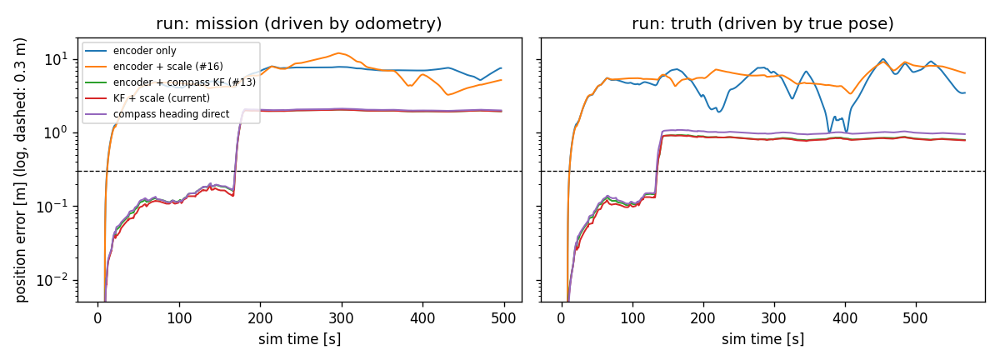

- 나침반 KF를 적용하면 R1 최종 오차가 74% 감소합니다(7.608 → 1.967 m).
- 회전 스케일(#16)을 적용하면 카펫 구간 전 165 s 시점 오차가 0.166 → 0.141 m(−15%)로 감소합니다. 최종 오차 차이는 0.002 m입니다.
- 재계산한 현재 조건 pose와 R1 기록 추정값의 최대 차이는 0 m입니다.

**오차 원인 분해**

step별 이동 증분 오차 $\lvert\Delta p_{\text{true}} - \Delta p_{\text{est}}\rvert$를 카펫 경계 ±0.2 m 구간과 나머지로 나눴습니다. 카펫 충돌 상자는 2.4 × 1.6 × 0.02 m이고 윗면은 바닥보다 5 mm 높습니다.

| 실행 | 누적 증분 오차 | 카펫 경계 구간 | 비율 | 체류 시간 |
|---|---|---|---|---|
| R1 | 3.49 m | 2.02 m | 58% | 20.2 s (전체 4%) |
| R2 | 2.75 m | 1.14 m | 41% | 22.8 s |

- R1: 166.1 ~ 181.0 s에 바퀴 공회전 148 step(9.5 s)이 발생했습니다. 엔코더 이동량 대비 실제 이동량은 50% 미만이며, 과대 추정량은 1.42 m입니다.
- R2: 138.8 ~ 142.6 s 제자리 회전 명령 중 실제 방향은 1.57 rad에 고정되었고 로봇은 +y 방향으로 0.14 m/s 이동했습니다.
- 두 현상 모두 라이다와 몸체 접촉점(높이 0.02 m 초과)으로 감지되지 않습니다.

**L2 지도 품질** (R1 라이다, 변형별 pose, 실제 pose 지도 대비 장애물 칸 F1, 1칸 허용)

| 변형 | 정밀도 | 재현율 | F1 |
|---|---|---|---|
| 엔코더만 | 0.162 | 0.208 | 0.18 |
| 엔코더 + 회전 스케일 | 0.111 | 0.151 | 0.13 |
| 엔코더 + 나침반 KF | 0.355 | 0.448 | 0.40 |
| KF + 회전 스케일 (현재) | 0.361 | 0.474 | 0.41 |

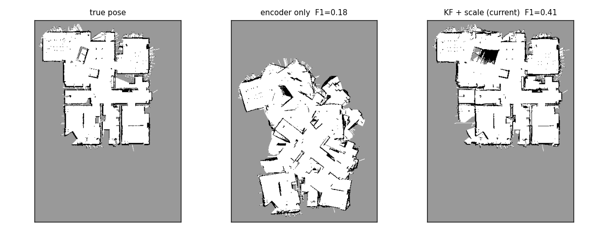

### 6.4 행동: 경로 추종과 안전 필터

| 함수 | 입력 | 출력 |
|---|---|---|
| `pure_pursuit(pose, path, lookahead)` | pose, 경로, look-ahead [m] | `(v, w, reached)` |
| `safety_filter(v, w, ranges)` | 속도 명령, 라이다 거리 | `(v, w, blocked)` |

look-ahead 점의 로봇 좌표 $(x_L, y_L)$에서 곡률을 계산합니다. 방위각이 55°를 초과하면 제자리 회전합니다.

$$
\kappa = \frac{2 y_L}{x_L^2 + y_L^2}, \qquad
\omega = \operatorname{clip}(v_{\max}\kappa,\ -\omega_{\max},\ \omega_{\max})
$$

안전 필터는 정지 거리 $d_{\text{stop}} = 0.20$ m에서 로봇 반지름 $R$과 여유 $m$을 덮는 반폭을 검사합니다.

$$
\alpha = \arctan\frac{R + m}{d_{\text{stop}}} = \arctan\frac{0.105 + 0.06}{0.20} = 39.5^\circ
$$

**C1 look-ahead** (S, 시작점 → 사과 1·2 고정 경로)

| look-ahead | 도착 시간 [s] | 경로 이탈 RMS [m] | 경로 이탈 최대 [m] | 벽 최소 거리 [m] |
|---|---|---|---|---|
| 0.20 m | 75.6 / 41.0 | 0.007 / 0.006 | 0.037 / 0.035 | 0.170 / 0.139 |
| 0.35 m (현재) | 75.1 / 40.6 | 0.017 / 0.015 | 0.074 / 0.064 | 0.139 / 0.139 |
| 0.50 m | 74.6 / 40.1 | 0.030 / 0.030 | 0.134 / 0.101 | 0.094 / 0.094 |

**C2 제자리 회전** (S, 경로 반대 방향으로 출발)

| 조건 | 도착 시간 [s] | 경로 이탈 최대 [m] | 벽 최소 거리 [m] | 안전 필터 차단 step |
|---|---|---|---|---|
| 55° 제자리 회전 (현재) | 76.6 / 42.0 | 0.118 / 0.110 | 0.139 / 0.120 | 0 / 0 |
| 제자리 회전 없음 | 83.4 / 47.9 | 0.353 / 0.357 | 0.070 / 0.020 | 56 / 45 |

**C3 안전 필터 반폭** (Y, 정면 1 m 거리의 5 cm 기둥, 측면 오프셋 0 ~ 0.20 m, 0.005 m 간격 41조건)

| 반폭 | 정지 거리 지점 검사 폭 | 충돌 조건 | 충돌 오프셋 |
|---|---|---|---|
| 25° (#11 이전) | ±0.093 m (반지름 0.105 m 미만) | 11 / 41 | 0.100 ~ 0.150 m |
| 39.5° (현재) | ±0.165 m | 0 / 41 | 없음 |

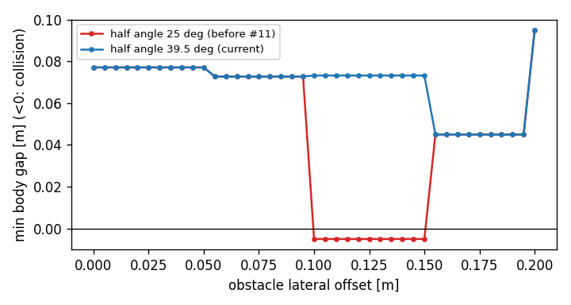

**C4 라이다 최소 거리 여유**: 64 ms step당 최대 이동은 $0.18 \times 0.064 = 0.0115$ m입니다. `STOP_DIST` 0.20 m와 라이다 최소 0.12 m의 차이 0.08 m는 6.9 step에 해당합니다.

### 6.5 계획: 점유 격자

| 함수 | 입력 | 출력 |
|---|---|---|
| `GridMap.update(pose, ranges)` | pose, 라이다 거리 | 없음 |
| `GridMap.layers()` | 없음 | `(occ, blocked, soft, unknown)` |
| `GridMap.frontiers()` | 없음 | `[(칸 수, [(row, col), ...]), ...]` |

$$
l \leftarrow \operatorname{clip}(l + L_{\text{occ/free}},\ L_{\min},\ L_{\max}), \qquad
L_{\text{occ}} = 0.9,\ L_{\text{free}} = -0.4,\ [L_{\min}, L_{\max}] = [-2.0,\ 3.5]
$$

**P1 상·하한 고정** (Y, 칸 1개를 $k$회 장애물로 관측한 뒤 빈칸 관측으로 $l \le 0.3$이 될 때까지 시간)

| 점유 지속 | 상·하한 고정 (현재) | 상·하한 없음 |
|---|---|---|
| 1.5 s (보행자 0.3 m, 0.2 m/s 통과) | 0.51 s | 3.33 s |
| 5.0 s | 0.51 s | 11.20 s |
| 10.0 s | 0.51 s | 22.46 s |

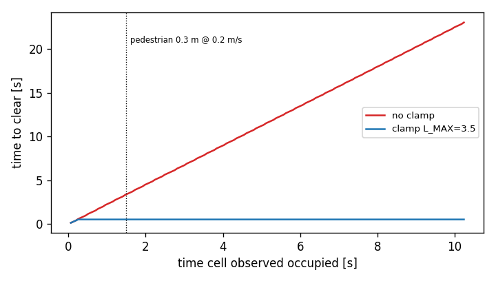

### 6.6 계획: 경로와 탐색

| 함수 | 입력 | 출력 |
|---|---|---|
| `plan(grid, start, goal, allow_unknown, field)` | 격자, 시작·목표 | 경로 또는 `None` |
| `choose_frontier(grid, pose, blacklist)` | 격자, pose, 제외 목록 | 목표 또는 `None` |
| `DistanceField(grid, origin)` | 격자, 기준점 | 기준점 비용 지도 |

간선 비용은 벽 근처 배수를 포함합니다. $d$는 장애물 거리, $B$는 `WALL_BAND` 0.20 m, $k_{\text{wall}}$은 `WALL_COST`입니다.

$$
w(u, v) = s\,\frac{c_u + c_v}{2}, \qquad
c = 1 + k_{\text{wall}}\operatorname{clip}\left(\frac{R_{\text{inf}} + B - d}{B},\ 0,\ 1\right)
$$

**P2 경로 탐색 방법** (S, 시작점 → 사과 1 / 사과 2, 5회 중앙값)

| 방법 | 계산 시간 [ms] | 도달 칸 수 | 경로 길이 [m] |
|---|---|---|---|
| A\* (현재) | 18.7 / 11.5 | 8916 / 4873 | 13.87 / 7.59 |
| 다익스트라 (`DistanceField.path`) | 81.0 / 75.1 | 73734 / 73734 | 13.73 / 7.60 |
| A\* + 비용 지도 휴리스틱 | 9.9 / 6.9 | 1881 / 1172 | 13.82 / 7.63 |

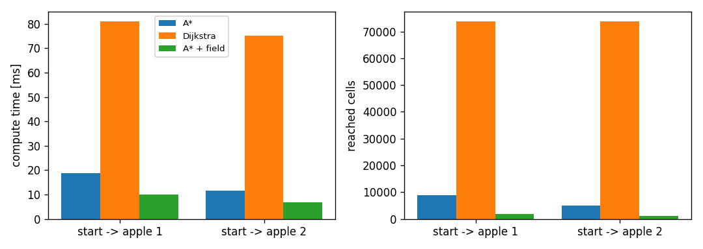

A\* 적용 시 도달 칸 수는 다익스트라 대비 88 ~ 93% 감소합니다. 비용 지도 휴리스틱은 생성 시간 71.8 ~ 74.3 ms가 추가됩니다. 따라서 같은 지도에서 여러 번 계획할 때만 계산 시간이 감소합니다.

**P3 ~ P5 경로 설정값** (S, 사과 1 / 사과 2)

| 설정 | 경로 길이 [m] | 10° 초과 방향 전환 | 벽 최소 거리 [m] |
|---|---|---|---|
| 벽 비용 0 | 13.19 / 7.03 | 4 / 4 | 0.028 / 0.011 |
| 벽 비용 2 (현재) | 13.87 / 7.59 | 11 / 9 | 0.139 / 0.139 |
| 벽 비용 4 | 13.87 / 7.65 | 11 / 9 | 0.139 / 0.139 |
| 다듬기 없음 | 14.22 / 7.92 | 18 / 28 | 0.170 / 0.139 |
| 팽창 0.105 m | 13.51 / 7.46 | 7 / 7 | 0.120 / 0.070 |
| 팽창 0.175 m (현재) | 13.87 / 7.59 | 11 / 9 | 0.139 / 0.139 |
| 팽창 0.25 m | 14.03 / 7.87 | 11 / 11 | 0.162 / 0.205 |

설정 이름은 `WALL_COST`, `PATH_SMOOTH`, `INFLATE`입니다. 도달 가능 면적은 팽창 0.105 / 0.175 / 0.25 m에서 86.6 / 74.7 / 62.4 m²이고, 나머지 설정에서는 74.7 m²입니다.

- 벽 비용 2.0 적용 시 경로 길이는 5% 증가하고 벽 최소 거리는 0.011 m에서 0.139 m로 증가합니다.
- 경로 다듬기 적용 시 길이는 2.5 ~ 4.4%, 방향 전환은 39 ~ 68% 감소합니다.
- 팽창 반경 0.175 m의 도달 가능 면적은 0.25 m 대비 20% 넓습니다.

**P6 프론티어 선택** (S, 600 s, 시작 방향 −0.2 / 0 / +0.2 rad 3회)

| 조건 | 90% 확인 시간 [s] | 90% 달성 | 최종 확인 | 충돌 step |
|---|---|---|---|---|
| $N/d$, 2 s 재선택 (현재) | 400 (238 ~ 400) | 3 / 3 | 93.2% | 0 |
| 최근접 $N^0/d$ | 미달성 | 0 / 3 | 21.6% | 0 |
| 묶음 우선 $N^2/d$ | 481 (376 ~ 492) | 3 / 3 | 92.5% | 8 |
| $N/d$, 목표 유지 | 360 (339 ~ 468) | 3 / 3 | 93.0% | 0 |
| $N/d$, 0.5 s 재선택 | 350 (337 ~ 360) | 3 / 3 | 93.6% | 0 |
| $N/d$, 1 s 재선택 | 342 (283 ~ 342) | 3 / 3 | 93.0% | 0 |
| $N/d$, 5 s 재선택 | 362 (358 ~ 362) | 3 / 3 | 94.6% | 0 |

90% 확인 시간은 3회 중앙값이고 괄호는 최솟값 ~ 최댓값입니다. 최종 확인은 3회 평균입니다.

| 조건 | 주행 거리 [m] | 차단 step | 계획 시간 합 [s] |
|---|---|---|---|
| $N/d$, 2 s 재선택 (현재) | 89.4 | 617 | 8.33 |
| 최근접 $N^0/d$ | 7.5 | 3890 | 2.68 |
| 묶음 우선 $N^2/d$ | 75.7 | 2053 | 8.30 |
| $N/d$, 목표 유지 | 80.2 | 1089 | 4.24 |
| $N/d$, 0.5 s 재선택 | 85.3 | 456 | 25.11 |
| $N/d$, 1 s 재선택 | 73.5 | 1208 | 12.74 |
| $N/d$, 5 s 재선택 | 69.9 | 2947 | 4.38 |

값은 3회 평균입니다.

- 최근접 선택 조건은 3회 모두 확인 면적 21.6%에서 탐색이 종료되었습니다. 벽에 인접한 가까운 프론티어에서 차단과 블랙리스트 등록이 반복되었습니다.
- 묶음 크기 우선 조건은 90% 확인 시간이 20% 증가했고 충돌 step은 8건이었습니다.
- 목표 유지 조건은 계획 시간 합이 49%, 90% 확인 시간 중앙값이 10% 짧습니다. 현재 조건의 3회 범위(238 ~ 400 s) 안의 차이이므로 확정 결론이 아닌 개선 후보로 분류합니다.

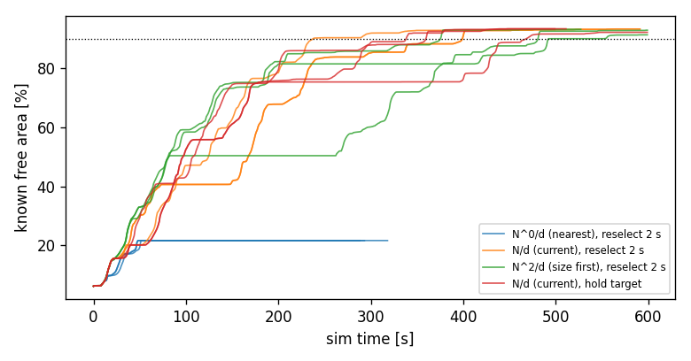

### 6.7 인지: 대상 검출

| 함수 | 입력 | 출력 |
|---|---|---|
| `TargetDetector.detect_all(bgr)` | BGR 이미지 | 검출 목록 (가까운 순) |
| `TargetDetector.to_world(det, pose)` | 검출, pose | 대상 월드 좌표 |
| `Confirm.update(seen, xy, dist)` | 검출 여부, 좌표, 거리 | `(확정 여부, 위치 추정)` |

처리 순서는 YOLO 후보 → 상자 안 빨강 비율 ≥ 0.25 → YOLO 밖 색 분할(원형도 ≥ 0.75, 채움 비율 ≥ 0.72) → 화면 위쪽 제외 → 거리 계산입니다.

$$
f = \frac{W/2}{\tan(\phi_h/2)} = 554.3\ \text{px}, \qquad
\beta = -\arctan\frac{c_x - W/2}{f}, \qquad
d = \frac{f D}{w \cos\beta}
$$

**V1 검출 변형 비교** (R1·R2 프레임 3855장, 실제 pose 라벨. 가시 프레임 31장)

| 변형 | 0 ~ 1 m | 1 ~ 2 m | 3 ~ 4 m | 오검출 / 100프레임 |
|---|---|---|---|---|
| 현재 (YOLO + 색 비율 + 형태 조건) | 100% | 100% | 50% | 0.03 |
| #17 이전 (`30f3271`) | 100% | 100% | 50% | 1.97 |
| YOLO만 (색 분할 보완 없음) | 100% | 100% | 50% | 0.03 |
| 색 분할만 | 100% | 90% | 100% | 0.00 |
| YOLO 클래스만 (색 비율 검사 없음) | 100% | 100% | 50% | 17.80 |

재현율 표본 수는 거리 구간별 19 / 10 / 2장입니다. 2 ~ 3 m 구간 표본은 0장입니다.

- 오검출 대상 (현재): 배경 1건
- 오검출 대상 (#17 이전): 배경 71건, 소화기 5건
- 오검출 대상 (색 비율 검사 없음): 배경 230건, 초록 사과 189건, 주황 사과 166건, 보라 사과 72건, 고양이 26건, 캔 3건

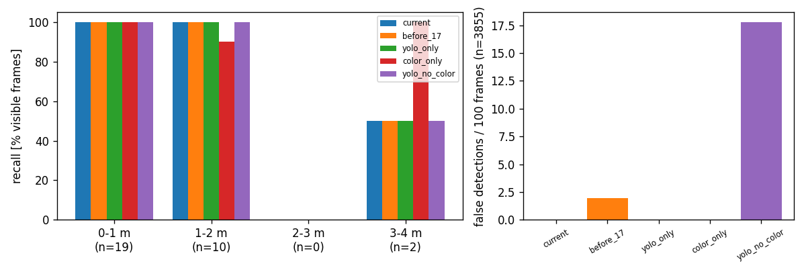

- 색 비율 검사를 제거하면 다른 색 사과 오검출이 427건 발생합니다.
- #17 형태 조건 적용 후 오검출은 1.97 → 0.03건/100프레임(−98%)으로 감소하고 재현율은 같습니다.
- 라벨: 가시선 판정 33장을 이미지로 확인한 결과 2장이 가려진 프레임이었습니다. 이 2장은 제외했습니다.
- JPG 저장 프레임과 실행 중 원본 화면의 검출 수 일치율은 99.92%입니다.

**V2 거리 추정** (현재 검출, 빨간 사과 일치 36건)

| 지표 | 값 |
|---|---|
| 오차 중앙값 (추정 − 실제) | −0.104 m |
| 오차 범위 | −0.487 ~ −0.081 m |
| 상대 오차 중앙값 | −11.0% |

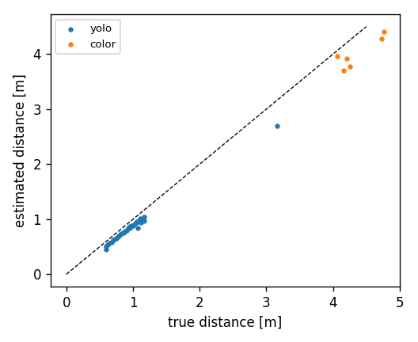

모든 추정값이 실제보다 짧습니다. 사과 지름 설정값 0.095 m(충돌 구 0.10 m)와 카메라 전방 오프셋이 편향 원인 후보입니다.

**V3 연속 확인 프레임 수** (R2 프레임 순서 재현)

| `CONFIRM_FRAMES` | 확정한 빨간 사과 | 오확정 | 사과 1 확정 시각 | 사과 2 확정 시각 |
|---|---|---|---|---|
| 1 | 2 | 1 (사과 1에서 0.61 m) | 149.8 s | 278.1 s |
| 2 | 2 | 1 (사과 1에서 0.54 m) | 150.1 s | 278.3 s |
| 3 | 2 | 0 | 153.4 s | 278.6 s |
| 4 (현재) | 1 | 0 | 미확정 | 278.8 s |
| 6 | 1 | 0 | 미확정 | 279.4 s |

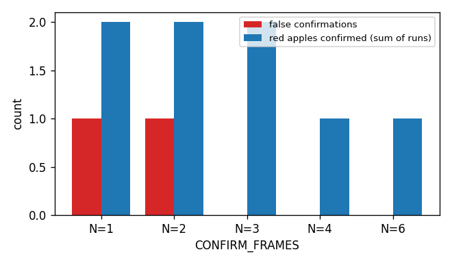

R2에서 사과 1 검출은 149.8 ~ 160.8 s에 7프레임이었고 최대 연속은 3프레임이었습니다. 따라서 현재 4프레임 조건으로는 확정되지 않습니다. Webots 폐루프 확인 결과는 6.8절 M5의 R4입니다.

### 6.8 통합: 상태 머신과 시간 예산

| 함수 | 입력 | 출력 |
|---|---|---|
| `Mission(io, odom, grid, detector, log)` | 모듈 객체 | 미션 |
| `Mission.tick()` | 없음 | 없음 |
| `fit_compass(samples)` | `[(오도메트리 방향, 나침반 원시각), ...]` | `(sign, offset, scale)` 또는 `None` |

나침반 원시각 $\varphi$와 보정 방향 $\theta = s_c\varphi + o$의 부호·오프셋은 시작 회전 표본에서 계산합니다. 첫 표본의 방향 $\theta_0$은 설정한 시작 방향입니다.

$$
s_c = \operatorname{sgn}\sum_k \Delta\theta_k\,\Delta\varphi_k, \qquad
o = \operatorname{wrap}(\theta_0 - s_c\varphi_0)
$$

**M1 나침반 보정 방식** (Y, 오도메트리 회전 비율 0.80 ~ 1.30, 조건당 30회)

| 방식 | σ = 0 | σ = 0.02 rad | σ = 0.05 rad |
|---|---|---|---|
| 잔차 RMS (이전) | 0.99 ~ 1.01만 성공 | 0.99 ~ 1.01만 성공 | 0.99 ~ 1.01만 성공 |
| 기준 방향 (현재) | 전 구간 100% | 최저 93.3%, 평균 99.2% | 최저 53.3%, 평균 71.6% |

회전 비율 1.104, σ = 0.05 rad 조건의 성공률은 이전 방식 0%, 현재 방식 70.7%입니다.

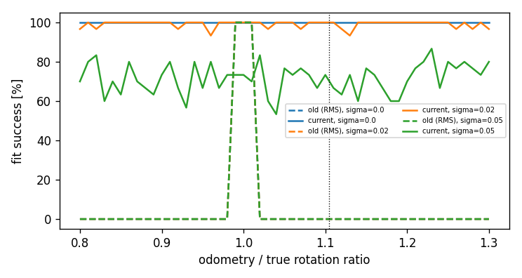

Webots 실측 회전 비율은 1.104이고 나침반 잡음은 σ = 0.00026 rad입니다. 이 조건에서 현재 방식은 성공, 이전 방식은 실패입니다. 현재 방식은 첫 표본 1개로 오프셋을 계산하므로 잡음 σ = 0.05 rad에서 성공률이 71.6%로 감소합니다.

**M2 연속 확인 호출 시점**: 추론하지 않은 step에도 `Confirm.update(False)`를 호출하면 R2 프레임 순서에서 확정 0건입니다. YOLO step에만 호출하는 현재 방식은 사과 2를 278.8 s에 확정합니다.

**M3 YOLO 추론 주기** (R2 실측: 추론 없는 step 중앙값 1.25 ms, YOLO 중앙값 20.6 ms)

| `YOLO_EVERY` | step당 계산 [ms] | 최대 실시간 배율 | 추론 간 이동 [m] | 추론 간 회전 |
|---|---|---|---|---|
| 1 | 21.9 | 2.9 | 0.012 | 2.9° |
| 2 | 11.6 | 5.5 | 0.023 | 5.9° |
| 4 (현재) | 6.4 | 10.0 | 0.046 | 11.7° |
| 8 | 3.8 | 16.7 | 0.092 | 23.5° |

최대 실시간 배율은 계산 시간만 고려한 값입니다. 추론 간 이동은 $v_{\max}$, 추론 간 회전은 시작 회전 속도 0.8 rad/s 기준입니다.

R2 실측 실시간 배율은 4.88입니다. Webots 물리·렌더링 시간이 추가되므로 계산 기준 최대값 10.0보다 작습니다.

**M4 재계획 주기** (R2 실측 계획 1회 중앙값 11.4 ms, 프론티어 선택 + 경로 2회 기준)

| `REPLAN_PERIOD` | 시뮬레이션 1 s당 계획 계산 [ms] | S 90% 확인 시간 중앙값 [s] |
|---|---|---|
| 0.5 s | 45.7 | 350 |
| 1 s | 22.8 | 342 |
| 2 s (현재) | 11.4 | 400 |
| 5 s | 4.6 | 362 |

90% 확인 시간 차이는 현재 조건 3회 범위(238 ~ 400 s) 안에 있습니다. 주기 선택 근거는 계산량이며, 2 s 주기의 계획 계산은 시뮬레이션 1 s당 11.4 ms입니다.

**M5 Webots 완주 결과**

| 실행 | 구조 | 구조 위치 오차 [m] | DONE 시각 [s] |
|---|---|---|---|
| R1 현재 main | 0 / 2 | 없음 | 495.3 |
| R2 실제 pose | 1 / 2 (사과 2) | 0.099 | 568.6 |
| R3 R1 + `CONFIRM_FRAMES=3` | 0 / 2 | 없음 | 495.3 |
| R4 R2 + `CONFIRM_FRAMES=3` | 2 / 2 | 0.132 / 0.111 | 374.9 |

| 실행 | 실제 복귀 오차 [m] | 추정 복귀 오차 [m] | 몸체 접촉 step | 실시간 배율 |
|---|---|---|---|---|
| R1 | 2.079 | 0.114 | 7 | 기록 없음 |
| R2 | 0.120 | 0.120 | 0 | 4.88 |
| R3 | 2.079 | 0.114 | 7 | 4.93 |
| R4 | 0.114 | 0.114 | 0 | 5.34 |

- R1과 R3는 궤적이 같습니다. R1에서는 빨간 사과가 가시선 안에 들어온 프레임이 없어 확정 조건이 결과에 영향을 주지 않습니다.
- R2는 사과 1 검출이 최대 연속 3프레임이라 확정하지 못했습니다. 사과 1 방향 목표 2개가 제한 시간 초과로 제외되었습니다.
- R4는 153.7 s에 사과 1을 확정하고 192.8 s에 구조했습니다.

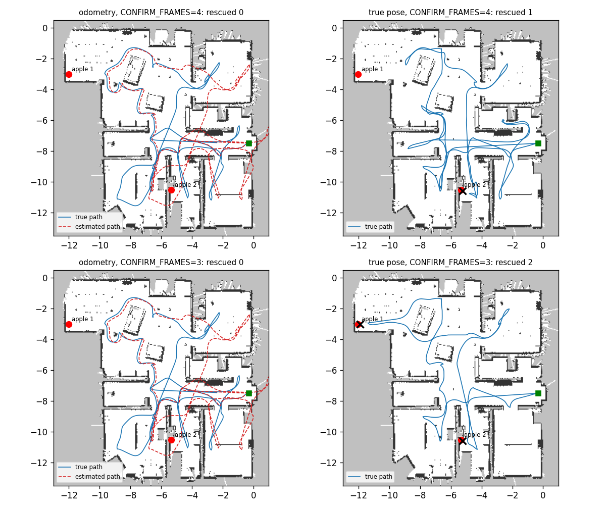

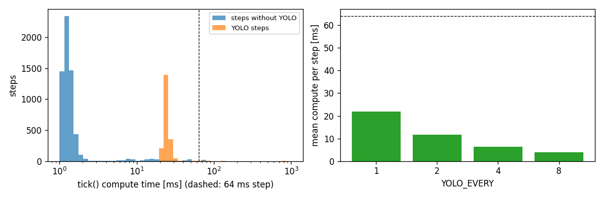

## 7. 기타 고려사항

### 7.1 예외 처리

| 상황 | 처리 | 위치 |
|---|---|---|
| 센서 값 `None` | 지도·추정 갱신 생략, 안전 필터 통과 | `grid_map.update`, `safety_filter` |
| YOLO 로드·추론 실패 | `load_error`·`last_error` 기록 후 색 분할만 사용 | `perception.TargetDetector` |
| 경로 없음 | 프론티어 블랙리스트 등록, 복귀는 모르는 칸 허용 재계획 | `mission._explore`, `_return` |
| 나침반 보정 실패 | 엔코더 방향만 사용 | `mission._init_spin` |
| 정체 4 s, 이동 5 cm 미만 | RECOVERY (후진 1 s, 회전 1.5 s) | `mission._watch` |
| 안전 필터 연속 차단 3 s | 경로 재계획 | `mission._watch` |
| 접근 60 s 초과 | 대상 제외 후 EXPLORE | `mission._approach` |
| 남은 시간 150 s 미만 | RETURN | `mission.tick` |
| 지도 저장 실패 | 로그 기록 후 계속 | `mission._save_map` |

### 7.2 충돌 방지 계층

| 계층 | 방법 | 수치 |
|---|---|---|
| 1 | 장애물 팽창 | 0.175 m (로봇 반지름 + 0.07 m) |
| 2 | 벽 근처 비용 | 팽창 경계에서 배수 3.0, 0.20 m 폭 |
| 3 | 라이다 안전 필터 | 0.20 m, 반폭 39.5° |
| 4 | RECOVERY | 4 s 정체 판정 |

라이다 높이 아래 물체(사과, 캔, 카펫 경계)는 1 ~ 3계층으로 감지되지 않습니다. R1 몸체 접촉 7 step은 139 s 시점 (−9.51, −3.82)에서 발생했습니다.

### 7.3 보안

오프라인 시뮬레이션이며 외부 통신과 비밀값이 없습니다. 보안 요구사항은 해당 없음입니다.

### 7.4 테스트 전략

| 단계 | 명령·조건 | 결과 |
|---|---|---|
| 모듈 단독 (`sar/` 7개) | `python -m sar.<모듈>` | 통과 |
| pytest | `.venv/bin/python -m pytest -q` | 179 passed, 1 skipped (Intro 동기화 검사, 작업 폴더 위치) |
| 경로 독립 검사 | `tests/planner_checks.py` | #15 기준 통과 |
| 합성 주행 | `tests/test_planner_drive.py` | 2개 통과 |
| 설계 근거 20종 | `scripts/design_eval.py` | 이 문서 6장 |
| Webots 완주 | `worlds/sar_apartment.wbt`, 측정은 `sar_apartment_eval.wbt` | M5 |
| CI | GitHub Actions `ci.yml` (ruff, pytest) | PR마다 실행 |

### 7.5 검증 한계

| 항목 | 한계 |
|---|---|
| L, L2 | 기록한 궤적의 개루프 재계산. 추정 오차에 따른 경로 변화 미포함 |
| S 시뮬레이션 | 오차 없는 pose, 라이다 단면 지도. 바퀴 미끄러짐, 보행자, 라이다 아래 물체 미포함 |
| V 라벨 | 가시 프레임 31장. 3 ~ 4 m 구간 표본 2장 |
| P6 | 초기 방향 3조건. 조건 간 차이가 표본 범위 안인 항목은 결론에서 제외 |
| Webots | 조건별 1회 실행. 결정적 실행이므로 반복 대신 조건 변경으로 비교 |

### 7.6 알려진 문제와 개선 후보

| 순위 | 항목 (담당) | 근거 |
|---|---|---|
| 1 | 카펫 경계 바퀴 공회전 감지·보정 (행동) | R1 증분 오차의 58%가 20 s 구간. 스캔 매칭 도입 기준 0.3 m 초과 (1.965 m) |
| 2 | `CONFIRM_FRAMES` 4 → 3 (인지·통합) | R2 재현: 사과 2개 확정, 오확정 0건. R4 Webots 2 / 2 구조 |
| 3 | 거리 추정 편향 보정 (인지) | 모든 일치 검출이 실제보다 짧음 (중앙값 −0.104 m) |
| 4 | 프론티어 목표 유지 (계획·통합) | S에서 90% 확인 시간 중앙값 400 → 360 s(−10%), 계획 시간 합 8.33 → 4.24 s(−49%) |
| 5 | look-ahead 0.20 m 검토 (행동) | S에서 경로 이탈 RMS 59% 감소, 시간 차이 1% 미만. Webots 미확인 |

### 7.7 변경 이력

| 버전 | 날짜 | 변경 | 작성자 |
|---|---|---|---|
| 1.0 | 2026-09-30 | 최초 작성. 측정 실행 4회, 실험 20종 결과 | 김태훈 |

## 관련 자료

- 측정 도구: [sar_eval 기능 설명](features/sar_eval.md)
- 모듈 상세: [mission](features/mission.md), [perception](features/perception.md), [grid_map](features/grid_map.md), [planner](features/planner.md), [viz](features/viz.md)
- 과제 기준: [과제와 구현 기준](../reference/sar-과제-구현-기준.md)
- 이전 분석: [sar-robot 병합 내용 분석](sar-robot-병합-분석.md)
- 코드 구조: sar-robot [코드 구조](https://github.com/Tech-Week-2026-KimEPark/sar-robot/blob/main/docs/human/explanation/architecture.md)
