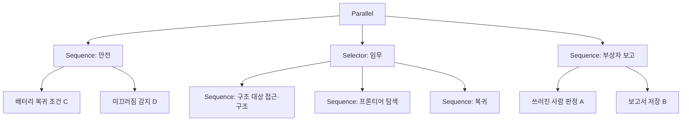

# SAR 창의성·확장성 설계

이 문서는 평가 기준 중 창의성과 확장성(코드로 구현, 글로 구현)에 대응하는 설계를 설명합니다. 창의성 주제는 산악 지형에서 부상 등산객을 탐색하는 구조 드론입니다. 기본 과제(빨간 사과 2개 구조 후 복귀)의 설계와 측정 결과는 [SAR 로봇 시스템 설계서](sar-시스템-설계.md)에 있습니다.

| 항목 | 내용 |
|---|---|
| 작성자 | 김태훈 (통합) |
| 작성일 | 2026-09-30 |
| 버전 | 1.0 |
| 승인 상태 | 검토 중 (팀 리뷰 대기) |
| 기준 코드 | sar-robot `main` `199349b` |

## 1. 평가 기준 대응

| 평가 항목 | 대응 | 산출물 | 상태 |
|---|---|---|---|
| 완전성 | 빨간 사과 2개 구조, 시작점 복귀 | `sar_main`, 설계서 6.8절 M5 | 위치 오차 제거 조건 2 / 2 구조 확인. 현재 main 0 / 2 |
| 창의성 | 산악 부상자 탐색 드론 시나리오, 행동 규칙 4개 | 이 문서 3장, `mission`·`config` | 설계 완료, 구현 예정 |
| 확장성 (코드) | 설정값 기반 대상·조건 변경, 장치 계층 분리, 측정 도구 | `config.py`, `robot_io`, `sar_eval` | 구현 완료 (4.1절 수치) |
| 확장성 (글) | 드론·실물 로봇·ROS2 이식, Behavior Tree 전환, 다중 로봇 | 이 문서 4.2절, 제출 README | 설계 완료 |
| 제출 README | 평가 환경 재현 절차 | sar-robot `README.md` | 완주 확인 후 작성 |

## 2. 시나리오

### 2.1 상황

겨울 산악 지역(예: 시베리아 산맥)에서 등산객이 부상으로 쓰러진 상황입니다. 구조 드론은 GPS 수신이 불안정한 계곡과 숲을 탐색해 부상자 위치를 구조대에 보고한 뒤 이착륙 지점으로 복귀합니다. 저온에서는 배터리 용량이 감소하고, 눈·얼음 지면에서는 미끄러짐이 발생합니다.

### 2.2 평가 월드 대응

Webots 평가는 TurtleBot3와 apartment 월드로 수행합니다. 월드 요소를 산악 시나리오 요소로 대응시킵니다.

| apartment 요소 | 산악 시나리오 의미 | 로봇 동작 |
|---|---|---|
| 빨간 사과 2개 | 부상자의 고시인성 장비 (빨간 배낭·방수포) | APPROACH·RESCUE (기본 과제) |
| 쓰러진 사람 (측정 월드에 1명 추가 예정) | 부상 등산객 | 부상자 판정, 위치·사진 보고 후 탐색 계속 |
| 걷는 보행자 (0.2 m/s) | 자력 이동 가능 등산객 | 이동 인원 기록, 구조 대상 제외 |
| 카펫 경계 (높이 5 mm) | 눈·얼음 지면 경계 | 미끄러짐 감지 후 감속·재정위 |
| 제한 시간 900 s | 배터리 비행 가능 시간 (저온 감소) | 복귀 거리 기반 복귀 시점 판단 |
| 계단 (−4.33, −5.82) | 절벽·크레바스 | 진입 금지 구역 |
| 시작점 (−0.3, −7.5) | 이착륙 지점 (베이스캠프) | RETURN·DONE |

## 3. 창의성: 재난 대응 행동 규칙

### 3.1 규칙 목록

| 번호 | 규칙 | 근거 수치 | 구현 위치 | 담당 |
|---|---|---|---|---|
| A | 쓰러진 사람 판정 | YOLO COCO 사람 클래스 0을 같은 추론 결과에서 사용. 추가 추론 없음 | `mission._perceive`, `config` | 통합 (인지 리뷰) |
| B | 구조 보고서 | 구조·부상자 위치, 시각, 근거 화면을 CSV 1개로 출력 | `mission`, `viz` | 통합 (인지 리뷰) |
| C | 복귀 거리 기반 복귀 판단 | 실측 복귀 41.2 ~ 47.2 s. 고정 예비 150 s 대비 103 ~ 109 s 미사용 | `mission.tick`, `config` | 통합 |
| D | 미끄러짐 감지 | R1 카펫 경계 9.5 s 공회전으로 위치 오차 1.42 m 발생 | `odometry`, `mission` | 행동·통합 |
| E | 진입 금지 구역 (선택) | 라이다 단면으로 감지되지 않는 위험 지형 | `grid_map`, `config` | 계획 |

### 3.2 규칙 A: 쓰러진 사람 판정

- YOLO 추론에 COCO 클래스 0(person)을 추가합니다. 사람 상자는 빨간 사과 후보에서 제외합니다.
- 상자 가로/세로 비율 $r = w/h$로 자세를 구분합니다. $r \ge 1.3$이면 쓰러진 사람으로 판정합니다.
- 거리는 사람 상자 중심 방위의 라이다 값으로 계산합니다. 사과 지름 기반 거리식은 사람에 적용하지 않습니다.
- 확정은 빨간 사과와 같은 `Confirm`(연속 3 ~ 4프레임, 위치 0.5 m 이내)을 사용합니다.
- 부상자 확정 시 상태를 바꾸지 않습니다. 위치와 카메라 화면을 기록한 뒤 탐색을 계속합니다.

| 설정값 | 값 | 의미 |
|---|---|---|
| `PERSON_CLASS` | 0 | COCO 사람 클래스 |
| `LYING_ASPECT` | 1.3 | 쓰러진 자세 판정 가로/세로 비율 하한 |

| 검증 항목 | 조건 | 목표 |
|---|---|---|
| 서 있는 보행자 오판정 | `sar_apartment.wbt` 전체 실행 | 0건 |
| 쓰러진 사람 판정 | 측정 월드에 누운 보행자 1명 추가 | 확정 1건, 위치 오차 0.5 m 이내 |
| 추론 시간 증가 | R2 대비 YOLO 중앙값 | 5% 이내 |

### 3.3 규칙 B: 구조 보고서

- 출력 파일은 `output/rescue_report.csv`입니다. 열은 `kind, n, x, y, t, source, conf, image`입니다.
- `kind`는 `target`(구조 대상)과 `victim`(부상자) 2종류입니다.
- 사건마다 파일 전체를 다시 저장합니다. 실행이 중단되어도 직전 사건까지 기록이 남습니다.
- `map_final.png`에 구조 위치와 부상자 위치를 다른 표식으로 표시합니다.

### 3.4 규칙 C: 복귀 거리 기반 복귀 판단

현재 규칙은 남은 시간이 고정 예비 시간 150 s 미만일 때 복귀합니다. 변경 규칙은 복귀 필요 시간을 현재 위치에서 계산합니다. $T$는 제한 시간, $\eta$는 저온 배터리 감소 계수, $k$는 경로/직선 거리 비율, $d$는 시작점까지 직선거리, $t_m$은 여유 시간입니다.

$$
t_{\text{remain}} = \eta T - t, \qquad
t_{\text{need}} = \frac{k\,d}{v_{\max}} + t_m, \qquad
\text{RETURN if } t_{\text{remain}} < t_{\text{need}}
$$

| 설정값 | 값 | 근거 |
|---|---|---|
| `BATTERY_DERATE` ($\eta$) | 1.0 (평가), 0.7 (저온 시연) | 평가 조건은 감소 없음. 저온 값은 시연용 가정 |
| `RETURN_PATH_FACTOR` ($k$) | 1.5 | R2·R4 실측 1.17 ~ 1.32에 여유 반영 |
| `RETURN_MARGIN` ($t_m$) | 30 s | 복귀 중 정체 1회 복구 시간(RECOVERY 2.5 s)과 재계획 여유 |

| 비교 | 고정 예비 150 s | 거리 기반 |
|---|---|---|
| 시작점 7.08 m (R2 복귀 시작) | 150 s 예비 | 89 s 예비 (61 s 탐색 추가) |
| 월드 최대 거리 약 13 m | 150 s 예비 | 138 s 예비 |
| 실측 복귀 시간 | 41.2 ~ 47.2 s | 같음 |

### 3.5 규칙 D: 미끄러짐 감지

설계서 6.3절에서 카펫 경계 ±0.2 m 구간(체류 시간 4%)이 R1 누적 이동 오차의 58%를 차지했습니다. 눈·얼음 지면에서 같은 현상이 발생합니다.

- 엔코더 직진 이동량 $\Delta s_{\text{enc}}$와 정면 라이다 거리 변화량 $\Delta r_{\text{front}}$를 비교합니다.
- $\Delta s_{\text{enc}} > 0.005$ m인 step이 1 s 동안 연속이고 $\lvert\Delta r_{\text{front}}\rvert < 0.5\,\Delta s_{\text{enc}}$이면 미끄러짐으로 판정합니다.
- 판정 시 해당 구간 엔코더 이동량을 위치 갱신에서 제외하고 `V_APPROACH`(0.10 m/s)로 감속합니다.

| 검증 항목 | 조건 | 목표 |
|---|---|---|
| R1 기록 재계산 | 166.1 ~ 181.0 s 공회전 구간 | 감지 1건, 과대 추정 1.42 m → 0.3 m 이하 |
| 오감지 | R2 기록 (공회전 3 step) | 0건 |

### 3.6 규칙 E: 진입 금지 구역 (선택)

`NO_GO_ZONES = [(xmin, ymin, xmax, ymax), ...]` 사각형을 점유 격자의 장애물 칸에 추가합니다. 경로 계획과 프론티어 선택에 자동 반영됩니다. 평가 월드에서는 계단 영역을 크레바스로 지정합니다. 빨간 사과 2개와 겹치지 않으므로 기본 과제 결과에 영향이 없습니다.

## 4. 확장성

### 4.1 코드로 구현

| 확장 방식 | 구현 | 수치 |
|---|---|---|
| 설정값 기반 조건 변경 | 모든 숫자 상수를 `config.py`에 정의 | 설정값 105개. 대상 색·개수·시작 pose·YOLO 클래스 변경 시 코드 수정 0줄 |
| 장치 계층 분리 | Webots API 호출을 `robot_io.py`로 한정 | Webots import 파일 1개, 137줄 (팀 코드 2317줄의 5.9%) |
| 모듈 인터페이스 고정 | `CONTEXT.md` 6장 함수 형식 | 역할 4개가 서로 다른 파일 수정 |
| 측정 도구 | `sar_eval` + `SAR_EVAL_SET` | 팀 코드 수정 0줄로 Supervisor 기록, 설정값 조건 비교 (설계서 6장 실험 20종) |
| 대상 확장 | `TargetDetector(color, model_path)` | `HSV_RANGES` 4색 정의. 규칙 A는 같은 추론에 클래스 1개 추가 |

측정 도구는 확장성을 수치로 확인한 사례입니다. `controller.Robot`을 `Supervisor`로 교체하는 방식으로 팀 코드 수정 없이 실제 pose 기록과 위치 오차 제거 조건을 구현했습니다.

### 4.2 글로 구현

**드론 이식** (Webots `Mavic2Pro` 기준)

| 현재 인터페이스 | 드론 대응 |
|---|---|
| `RobotIO.drive(v, w)` | 고도 유지 제어 + 전진 피치·요 각속도 명령 |
| `RobotIO.encoders()` + `Odometry` | GPS·관성 센서 위치 (GPS 불안정 구간은 영상 기반 위치 추정) |
| `RobotIO.lidar()` | 하향 카메라·고도계. 장애물 격자 대신 탐색 완료 격자 사용 |
| `RobotIO.camera_bgr()` | 짐벌 카메라 |
| 프론티어 탐색 | 야외 지그재그 커버리지 탐색 |
| 규칙 A 판정 | 상공 시점에서 사람 상자 면적·형태 기준으로 재정의 |

**실물 로봇·ROS2 이식**

| 현재 인터페이스 | ROS2 대응 |
|---|---|
| `drive(v, w)` | `/cmd_vel` (`geometry_msgs/Twist`) 발행 |
| `lidar()` | `/scan` (`sensor_msgs/LaserScan`) 구독 |
| `encoders()` | `/odom` 또는 `/joint_states` 구독 |
| `camera_bgr()` | `/camera/image_raw` 구독, `cv_bridge` 변환 |
| `Mission.tick()` | 64 ms 타이머 콜백 |

**Behavior Tree 전환**

현재 상태 머신은 상태 7개입니다. 부상자 보고(규칙 A·B)와 배터리 감시(규칙 C)는 모든 상태에서 동시에 실행해야 하므로 Behavior Tree의 Parallel 노드로 표현합니다.

**다중 로봇**

탐색 구역을 로봇 수만큼 나눕니다. 각 로봇은 담당 구역의 프론티어만 선택하고 보고서를 공통 형식(규칙 B)으로 저장합니다. 병합 시 같은 부상자는 위치 0.6 m(`FOUND_EXCLUDE_RADIUS`) 이내 기준으로 1건 처리합니다.

## 5. 구현 계획

| 순서 | 작업 | 파일 | 담당 | 검증 |
|---|---|---|---|---|
| 1 | 규칙 C 복귀 판단 | `mission.py`, `config.py` | 통합 | pytest: 먼 위치에서 조기 복귀, 가까운 위치에서 탐색 유지 |
| 2 | 규칙 A 쓰러진 사람 판정 | `mission.py`, `config.py`, `perception.py` 1줄 | 통합, 인지 리뷰 | 측정 월드 누운 보행자 확정 1건, 서 있는 보행자 0건 |
| 3 | 규칙 B 보고서 | `mission.py`, `viz.py` | 통합, 인지 리뷰 | CSV 행 수·열 이름, 지도 표식 |
| 4 | 규칙 D 미끄러짐 감지 | `odometry.py` 또는 `mission.py` | 행동·통합 | R1 기록 재계산 목표 (3.5절) |
| 5 | 규칙 E 진입 금지 구역 | `grid_map.py`, `config.py` | 계획 | 금지 구역 경로 통과 0건 |
| 6 | 제출 README | `README.md` | 통합 | 평가 환경 절차 재현 |

기본 과제 동작 보장을 위해 규칙 A ~ E는 설정값 1개로 끌 수 있게 구현합니다. 모든 Webots 검증은 `worlds/sar_apartment.wbt`로 수행하고, 실제 pose가 필요한 측정만 `worlds/sar_apartment_eval.wbt`로 수행합니다.

## 6. 한계

| 항목 | 한계 |
|---|---|
| 드론 비행 | 구현하지 않음. 이식 방법은 4.2절 설계만 제공 |
| 저온 배터리 계수 | 0.7은 시연용 가정값. 실측 근거 없음 |
| 쓰러진 사람 인식 | Webots 보행자 모델의 YOLO 검출 여부 미확인. 2번 작업 전 측정 필요 |
| 미끄러짐 감지 | 정면 라이다 변화량 기준. 장애물이 없는 넓은 공간에서는 변화량 측정 불가 |

## 관련 자료

- 기본 과제 설계와 측정: [SAR 로봇 시스템 설계서](sar-시스템-설계.md)
- 측정 도구: [sar_eval 기능 설명](features/sar_eval.md)
- 평가 기준 원본: [과제와 구현 기준](../reference/sar-과제-구현-기준.md) 2장, 12장
- 상태 머신: [mission 기능 설명](features/mission.md)
