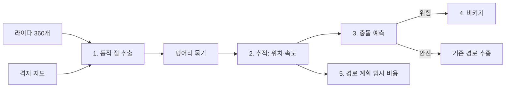

# 이동하는 사람 회피 설계

이 문서는 sar-robot에서 이동하는 사람(보행자)과의 충돌을 피하기 위한 설계 제안입니다. 2026-09-30 기준 코드의 한계, 제안 구조, 모듈별 인터페이스, 역할 분담, 검증 계획을 정리합니다. 아직 구현하지 않은 제안이므로 구현 후에는 모듈별 [기능 문서](features/README.md)로 옮기십시오.

## 1. 목표

과제 목표에는 "정적 장애물, 이동하는 사람과 충돌 금지"가 포함됩니다([과제와 구현 기준](../reference/sar-과제-구현-기준.md) 1.1절). 이 문서의 목표는 다음과 같습니다.

- 보행자와 로봇 사이 최소 거리를 안전 반경 이상으로 유지함
- 보행자가 지나간 뒤 탐색·접근·복귀를 이어서 수행함
- 대회 맵의 보행자 수와 경로를 모르는 상태에서도 동작함

## 2. 확인한 현재 상태

2026-09-30 sar-robot `main`(`199349b`)과 연습 맵 `worlds/apartment.wbt`에서 확인한 내용입니다.

### 2.1 연습 맵 보행자

| 항목 | 값 |
|---|---|
| 모델 | Webots `Pedestrian` PROTO 1명 |
| 속도 | 0.2 m/s (`controllerArgs --speed=0.2`) |
| 경로 | 좌표 25개를 잇는 고정 경로 왕복. 한 바퀴 42.4 m, 약 212초 |
| 빨간 사과 B (−5.34, −10.54)와의 최소 거리 | 0.81 m |
| 빨간 사과 A (−12.02, −3.02)와의 최소 거리 | 6.79 m |
| 시작점 (−0.3, −7.5)과의 최소 거리 | 4.60 m |

로봇 최고 속도는 `V_MAX` 0.18 m/s입니다. 로봇과 보행자가 마주 보고 움직이면 상대 속도는 0.38 m/s입니다. 사과 B에 접근하거나 구조하는 동안 보행자와 마주칠 가능성이 높습니다. 보행자 경로를 코드에 입력하는 방식은 대회 맵에 적용할 수 없으므로 사용하지 않습니다.

### 2.2 현재 코드의 처리

| 모듈 | 현재 동작 | 한계 |
|---|---|---|
| `local_control.safety_filter` | 진행 방향 ±반각 범위 라이다 최솟값이 `STOP_DIST`(0.20 m) 미만이면 선속도를 0으로 설정 | 정지만 함. 보행자는 멈춘 로봇으로 계속 걸어옴. 옆·뒤에서 다가오는 물체에 반응하지 않음 |
| `grid_map` log-odds | 사람이 지나간 칸은 8회 갱신 뒤 빈칸으로 복귀. 미션은 매 step 갱신하므로 약 0.5초 ([grid_map 기능 문서](features/grid_map.md)) | 현재 위치만 반영. 이동 방향과 속도가 없어 예측 불가 |
| `mission` | 안전 필터가 `BLOCKED_TIME`(3초) 동안 차단하면 재계획. `STUCK_TIME`(4초) 정체 시 RECOVERY | 반응이 3~4초 늦음. 상대 속도 0.38 m/s에서 3초는 1.1 m |
| 카메라 인식 | YOLO 후보 클래스는 apple, orange, sports ball | person 클래스는 사용하지 않음 |

## 3. 제안 구조

라이다로 움직이는 물체를 검출·추적하고, 예상 경로가 로봇과 가까워지면 로봇이 먼저 비켜서는 구조입니다. 5단계로 나누며 1~4단계는 매 step 실행합니다.



### 3.1 동적 점 추출

라이다 빔 $i$의 거리 $r_i$와 로봇 pose $(x, y, \theta)$로 끝점의 월드 좌표를 계산합니다. 빔 각도 $\alpha_i$는 [과제와 구현 기준](../reference/sar-과제-구현-기준.md) 5.4절 규칙을 따릅니다.

$$
\alpha_i = \pi - \frac{2\pi i}{360}, \qquad
(p_x,\ p_y) = \bigl(x + r_i \cos(\theta + \alpha_i),\ y + r_i \sin(\theta + \alpha_i)\bigr)
$$

끝점이 다음 조건을 모두 만족하면 동적 점으로 분류합니다.

- 해당 칸이 이미 확인된 칸이고 log-odds가 빈칸 쪽(0 미만)임
- 가장 가까운 장애물 칸과의 거리가 `DYN_WALL_GAP` 이상임. 오도메트리 오차로 벽 점이 어긋나 보이는 경우를 제외
- `grid.update()` 호출 전의 지도로 판정함. 갱신 후에는 사람이 찍힌 칸이 장애물로 바뀌어 동적 점이 사라짐

### 3.2 덩어리 묶기와 추적

- 인접 빔의 동적 점 사이 거리가 `DYN_CLUSTER_GAP` 미만이면 같은 덩어리로 묶음
- 폭이 `PERSON_MIN_WIDTH`~`PERSON_MAX_WIDTH`인 덩어리만 사람 후보로 사용. 다리 2개가 따로 보이면 중심 거리 `LEG_PAIR_DIST` 이내 덩어리를 합침
- 이전 추적 대상과 가장 가까운 후보를 `TRACK_GATE` 이내에서 연결함
- 위치 $\hat{\mathbf{p}}$와 속도 $\hat{\mathbf{v}}$는 알파-베타 필터로 갱신함. $\mathbf{z}$는 측정 위치, $\Delta t$는 step 간격

$$
\mathbf{p}^- = \hat{\mathbf{p}} + \hat{\mathbf{v}}\,\Delta t, \qquad
\mathbf{e} = \mathbf{z} - \mathbf{p}^-, \qquad
\hat{\mathbf{p}} \leftarrow \mathbf{p}^- + \alpha\,\mathbf{e}, \qquad
\hat{\mathbf{v}} \leftarrow \hat{\mathbf{v}} + \frac{\beta}{\Delta t}\,\mathbf{e}
$$

- `TRACK_CONFIRM`회 연속 연결되면 확정하고, `TRACK_TIMEOUT` 동안 연결되지 않으면 삭제함
- 속도가 `MOVING_SPEED` 미만인 대상은 정지 물체로 보고 기존 지도·안전 필터에 맡김

### 3.3 충돌 예측

사람 위치를 로봇 기준 상대 위치 $\mathbf{r}$, 상대 속도 $\mathbf{u} = \mathbf{v}_{\text{person}} - \mathbf{v}_{\text{robot}}$로 두고, 두 물체가 현재 속도를 유지한다고 가정합니다. 최근접 시각 $t^*$와 최근접 거리 $d_{\min}$은 다음과 같습니다.

$$
t^* = \operatorname{clip}\left(-\frac{\mathbf{r} \cdot \mathbf{u}}{\lVert \mathbf{u} \rVert^2},\ 0,\ T_h\right), \qquad
d_{\min} = \lVert \mathbf{r} + \mathbf{u}\, t^* \rVert
$$

$d_{\min} < R_{\text{safe}}$이면 충돌 위험으로 판정합니다. 안전 반경은 로봇 반지름, 사람 반경, 여유를 더한 값입니다.

$$
R_{\text{safe}} = 0.105 + 0.25 + 0.15 = 0.505\ \text{m}
$$

예측 시간 $T_h$는 3초를 제안합니다. 상대 속도 0.38 m/s에서 3초는 1.14 m이며, 로봇이 0.5 m 비켜서는 데 필요한 시간(회전 포함 약 3~4초)과 비슷합니다.

### 3.4 비키기

충돌 위험이 판정되면 경로 추종 대신 다음 동작을 수행합니다.

| 상황 | 동작 |
|---|---|
| 사람이 로봇 쪽으로 이동 중 | 사람 진행 방향에 수직인 두 방향 중 라이다 여유 공간이 넓은 쪽으로 `YIELD_DIST` 이동 후 정지 |
| 수직 방향 공간이 모두 좁음 (복도) | 사람 진행 방향으로 후진해 넓은 곳까지 물러남. 후진 시 안전 필터 후면 검사 사용 |
| 로봇이 사람 뒤를 따라가는 중 | 감속해 거리 유지 |
| 사람이 멀어지는 중 ($\mathbf{r} \cdot \mathbf{u} > 0$) | 비키기 종료 |

- 종료 조건: 위험 판정이 `YIELD_CLEAR_TIME` 동안 없거나, 사람이 멀어지는 중
- 종료 후 경로를 다시 계획함
- `YIELD_TIMEOUT` 초과 시 RECOVERY로 전환
- 기존 안전 필터는 최종 단계로 유지함. 비키기 명령도 안전 필터를 거침

규칙 기반 방식을 먼저 제안합니다. 여러 속도 후보를 시뮬레이션해 고르는 DWA(Dynamic Window Approach)나 속도 장애물(Velocity Obstacle) 방식은 움직임이 더 매끄럽지만 구현·튜닝 시간이 큽니다. 연습 맵 보행자 1명은 규칙 기반으로 처리할 수 있다고 판단합니다. 기본 동작을 확인한 뒤 필요하면 검토하십시오.

### 3.5 경로 계획 임시 비용

추적 중인 사람의 현재 위치와 $T_h$ 동안의 예측 위치 주변 `PERSON_COST_RADIUS` 이내 칸에 임시 비용을 더합니다. A* 재계획 시 사람의 예상 경로를 피하는 경로를 고르게 하기 위한 보조 단계입니다. 비용은 `PERSON_COST_DECAY` 동안 유지하고 이후 제거합니다. 재계획 주기(`REPLAN_PERIOD` 2초)가 길어 이 단계만으로는 충돌을 막을 수 없으므로 3.4절이 우선입니다.

경로 계획은 `GridMap.plan_version`이 같은 동안 계획 영역과 비용 배수를 재사용합니다([planner 기능 문서](features/planner.md) 계산 범위와 캐시 절). 임시 비용을 log-odds 배열에 직접 쓰면 지도가 오염되고, 캐시 때문에 계획에 반영되지 않을 수 있습니다. 다음 방식을 제안합니다.

- 임시 비용은 log-odds와 별도의 배열(사람 비용 층)에 저장함
- 사람 비용 층이 바뀌면 계획 캐시를 무효화함. `GridMap.invalidate()`는 팽창·프론티어 캐시까지 지우므로, 계획 모듈에 비용 층 전용 버전 번호를 두는 방식이 계산량 면에서 유리함
- 사람 비용 층은 통과 불가로 만들지 않고 비용 배수만 올림. 좁은 통로에서 경로가 없어지는 것을 방지

### 3.6 카메라 사용 범위

카메라는 주 센서로 사용하지 않습니다.

- 카메라 높이가 약 7 cm이므로 2 m 이내에서는 사람의 다리만 보임
- 발 위치로 거리를 계산하면 2 m에서 발이 화면 중심보다 약 20 px 아래에 있어 1 px 오차가 약 0.1 m 오차가 됨
- 수평 화각이 60°라 옆·뒤를 보지 못함

YOLO person 클래스(COCO 0)는 정면 덩어리가 사람인지 확인하는 보조 정보로만 사용할 수 있습니다. 움직이는 물체는 사람이 아니어도 피해야 하므로 확인 없이도 동작해야 합니다.

## 4. 인터페이스 제안

다음 형식은 제안입니다. 구현 전에 사용하는 모듈 담당자와 합의하고 [과제와 구현 기준](../reference/sar-과제-구현-기준.md) 7.2절과 `CONTEXT.md`를 같은 PR에서 갱신하십시오.

```python
# perception.py (인지)
class PersonTracker:
    def update(self, t: float, pose, ranges, grid) -> list[dict]
    # grid.update() 호출 전에 실행. 반환: 확정된 추적 대상
    # [{"id": int, "x": m, "y": m, "vx": m/s, "vy": m/s, "age": s}, ...]

# local_control.py (행동)
def predict_conflict(pose, robot_v: float, person: dict, horizon: float) -> tuple[float, float]
    # (t_star [s], d_min [m])
def yield_command(pose, ranges, person: dict) -> tuple[float, float, bool]
    # (v, w, done). 3.4절 규칙

# grid_map.py 또는 planner.py (계획)
def add_temporary_cost(cells_or_points, cost: float, until: float) -> None

# mission.py (통합)
# 상태 YIELD 추가. EXPLORE·APPROACH·RETURN 중 충돌 위험 시 진입, 종료 후 이전 상태로 복귀
```

매 step 처리 순서는 다음과 같습니다.

1. 센서 → 오도메트리
2. `PersonTracker.update()` (지도 갱신 전)
3. `grid.update()`
4. 인식(YOLO)
5. 충돌 예측 → 위험하면 YIELD, 아니면 상태별 처리
6. 안전 필터 → drive

설정값 초기 제안은 다음과 같습니다. 모두 `config.py`에 정의합니다.

| 설정값 | 제안 값 | 의미 |
|---|---|---|
| `DYN_WALL_GAP` | 0.15 m | 동적 점으로 인정하는 장애물 칸과의 최소 거리 |
| `DYN_CLUSTER_GAP` | 0.10 m | 같은 덩어리로 묶는 인접 점 거리 |
| `PERSON_MIN_WIDTH`, `PERSON_MAX_WIDTH` | 0.05 m, 0.60 m | 사람 후보 덩어리 폭 |
| `LEG_PAIR_DIST` | 0.40 m | 다리 2개를 한 사람으로 합치는 중심 거리 |
| `TRACK_GATE` | 0.50 m | 이전 추적 대상과 연결하는 최대 거리 |
| `TRACK_ALPHA`, `TRACK_BETA` | 0.5, 0.1 | 알파-베타 필터 계수 |
| `TRACK_CONFIRM` | 3회 | 추적 확정 연속 연결 횟수 |
| `TRACK_TIMEOUT` | 1.0 s | 연결 없이 유지하는 시간 |
| `MOVING_SPEED` | 0.05 m/s | 움직이는 대상으로 보는 속도 하한 |
| `PREDICT_HORIZON` | 3.0 s | 충돌 예측 시간 $T_h$ |
| `PERSON_SAFE_RADIUS` | 0.50 m | 안전 반경 $R_{\text{safe}}$ |
| `YIELD_DIST` | 0.5 m | 비키는 거리 |
| `YIELD_CLEAR_TIME` | 1.0 s | 위험 해제 확인 시간 |
| `YIELD_TIMEOUT` | 10 s | 비키기 최대 시간 |
| `PERSON_COST_RADIUS` | 0.6 m | 임시 비용 반경 |
| `PERSON_COST_DECAY` | 3.0 s | 임시 비용 유지 시간 |

## 5. 역할 분담 제안

| 역할 | 담당 | 범위 |
|---|---|---|
| 인지 (이온규) | `perception.PersonTracker` | 3.1~3.2절 동적 점 추출, 덩어리 묶기, 추적. 선택 사항으로 YOLO person 확인 |
| 행동 (김규민) | `local_control.predict_conflict`, `yield_command` | 3.3~3.4절 충돌 예측, 비키기, 후진 안전 검사 |
| 통합 (김태훈) | `mission` YIELD 상태 | 처리 순서 변경, 상태 전환, 로그 |
| 계획 (박상원) | 임시 비용 층 | 3.5절 사람 예측 위치 비용 |

구현 순서는 추적(인지) → 충돌 예측·비키기(행동) → YIELD 상태(통합) → 임시 비용(계획)을 제안합니다. 앞의 세 단계만으로 연습 맵 보행자 1명을 처리할 수 있어야 합니다.

## 6. 검증 계획

### 6.1 가상 환경

Webots 없이 pytest와 가상 방 실행으로 확인합니다. 가상 방은 레이 캐스팅 라이다와 속도 명령대로 움직이는 로봇에, 정해진 경로를 걷는 다리 2개(반지름 약 0.06 m 원 2개)를 추가해 구성합니다.

| 시나리오 | 통과 기준 |
|---|---|
| 정면으로 마주 옴 (넓은 방) | 최소 거리 ≥ `PERSON_SAFE_RADIUS` − 0.1 m, 접촉 0회 |
| 좁은 복도에서 마주 옴 | 후진으로 물러남, 접촉 0회 |
| 옆에서 가로질러 옴 | 정지 또는 비키기 후 경로 복귀 |
| 뒤에서 다가옴 | 앞으로 비켜서거나 옆으로 이동, 접촉 0회 |
| 사람이 멈춰 서 있음 | YIELD 진입 없이 정적 장애물로 우회 |
| 사람 없음 | 기존 미션 결과와 같음 (회귀) |

추적기는 단위 테스트로 위치·속도 추정 오차(속도 0.2 m/s에서 오차 0.05 m/s 이내 목표), 벽 근처 오도메트리 오차에 의한 거짓 검출 수를 확인합니다.

### 6.2 Webots

- apartment.wbt에서 사과 B 주변에 로봇을 두고 보행자가 지나가는 동안 미션 실행
- 기록 항목: 보행자와의 최소 거리, YIELD 진입·종료 시각, 재계획 횟수
- 보행자 한 바퀴(약 212초) 동안 2회 이상 마주치는 상황 확인

## 7. 미확인·결정 필요 항목

| 항목 | 내용 | 확인 방법·담당 |
|---|---|---|
| 라이다의 보행자 검출 | LDS-01 측정 높이에서 보행자 다리가 몇 개의 점으로 보이는지 미확인 | Webots에서 보행자 앞 라이다 값 기록. 인지 |
| 충돌 판정 기준 | 대회에서 사람과의 거리 기준·감점 방식 미확인 | 주최측 질문. 통합 |
| Webots 보행자 반응 | 보행자가 로봇을 피하거나 멈추지 않는지 미확인. PROTO는 정해진 경로를 따라 움직임 | Webots에서 로봇을 경로 위에 세워 확인. 행동 |
| 오도메트리 오차 영향 | 방향 오차로 벽 점이 동적 점으로 분류될 수 있음. 나침반 보정 후 오차 수준 미확인 | 가상 방과 Webots에서 거짓 검출 수 측정. 인지 |
| 사람이 사과를 가림 | 사과 B 주변에서 보행자가 카메라 시야를 가리는 경우 연속 확인 초기화 가능 | 미션 로그 확인. 통합 |

## 관련 자료

- 과제 목표와 설계 결정: [과제와 구현 기준](../reference/sar-과제-구현-기준.md) 1장, 9장 사람 회피 항목
- 현재 안전 필터: sar-robot `controllers/sar_main/sar/local_control.py`
- 현재 지도 갱신: [grid_map 기능 문서](features/grid_map.md)
- 계획 캐시: [planner 기능 문서](features/planner.md)
- 상태 머신과 처리 순서: [mission 기능 문서](features/mission.md)
- 알려진 제어 문제: [sar-robot 병합 내용 분석](sar-robot-병합-분석.md) 6장
