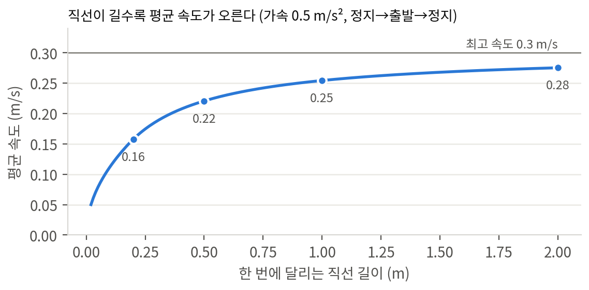
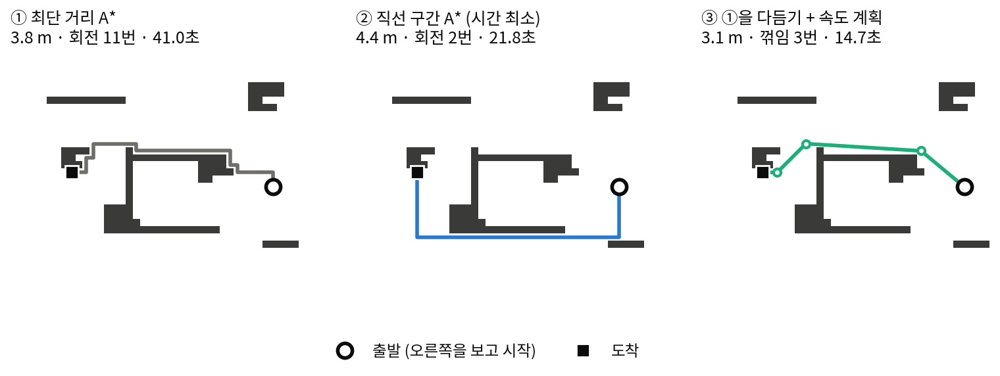
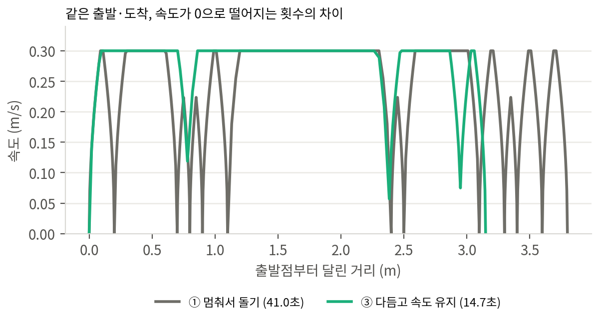
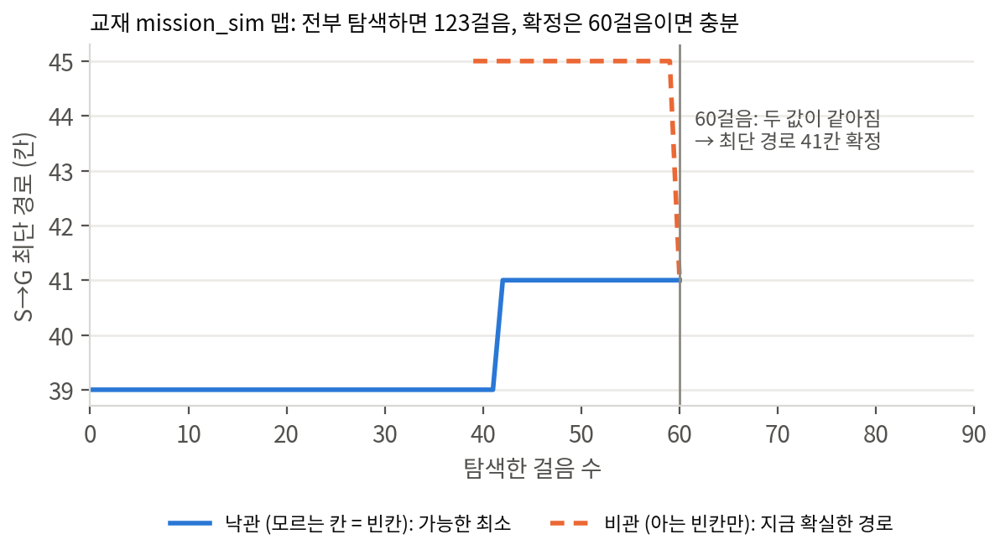

# 시간 최소 경로 가이드

최단 거리 경로 대신 최단 시간 경로를 계산하는 방법입니다. 회전 감소·속도 유지 경로, 탐색 조기 종료 판정, 관련 시간 단축 기법을 다룹니다. 코드는 모두 실행해 검증했습니다.

> **결론 요약**
>
> - 로봇은 회전할 때마다 감속·정지·회전·재가속 과정을 거칩니다. 경로 비용을 거리 대신 시간으로 계산하면 거리가 조금 길어도 회전이 적은 경로가 선택됩니다.
> - 격자선 주행 로봇은 직선 구간 A\*로 평균 시간이 15% 감소합니다(무작위 경기장 300개, 거리 +0.6%).
> - 사선 주행이 가능한 로봇은 경로 다듬기 + 속도 유지로 평균 시간이 33% 감소합니다.
> - 목적지를 알면 전체 탐색이 필요 없습니다. 낙관 경로와 비관 경로의 길이가 같아지면 최단 경로가 확정됩니다. 교재 미로에서 123걸음 → 60걸음, 열린 경기장 60개 평균 289걸음 → 44걸음으로 감소했습니다.
> - 해커톤에서는 채점에 시간 점수가 있을 때만 적용하십시오. 적용 시점은 최소 구현 완주 후 개선 구간(1:15~2:15)입니다. 기존 방식으로 즉시 롤백하는 설정값을 함께 구현하십시오.

## 형식별 적용 방법

| 형식 (플레이북) | 적용 방법 | 기대 효과 |
|---|---|---|
| S5 선 격자 미로, S3 격자 (회전이 별도 행동) | 직선 구간 A\* (2장) | 큼. 회전 수가 곧 시간·스텝 수 |
| S3 격자 (1칸 이동 = 1스텝, 회전 비용 없음) | 미적용 | 없음. 최단 거리가 곧 최단 시간 |
| S1·S2·S4 연속 주행 로봇 | 경로 다듬기 + 속도 계획 (3장), 조기 종료 (5장) | 가장 큼 |
| S6 드론 | 다듬기 + 긴 직선 위주 수색, 조기 종료 | 큼. 방향 전환마다 정지 |
| Nav2 사용 | 플래너·제어기 파라미터로 같은 효과 (6장) | 코드 수정 없이 적용 가능 |

fast_path.py가 이 문서의 코드 전체입니다. 표준 라이브러리만 사용합니다. 교재의 pathfinding.py·mission_sim.py와 같은 격자 규칙(`grid[r][c]`, 0 빈칸, 1 벽)을 따릅니다. 요약본에서 생략한 코드 전문은 원본 가이드와 fast_path.py에 있습니다.

## 1. 최단 거리 경로와 최단 시간 경로의 차이

차동 구동 로봇이 격자 경로를 주행하면 꺾이는 지점마다 감속, 정지, 제자리 회전, 자세 안정 대기, 재가속을 반복합니다. 이 과정의 이동 거리는 0이지만 소요 시간은 큽니다.

### 1.1 시간 모델

가속도 a로 최고 속도 vmax까지 가속한 뒤 같은 가속도로 감속해 정지하는 사다리꼴 속도를 가정합니다. 정지 상태에서 길이 L을 주행해 정지하는 시간은 다음과 같습니다.

```text
L ≥ vmax²/a인 경우: t(L) = L / vmax + vmax / a
L < vmax²/a인 경우 (최고 속도 미도달): t(L) = 2 √(L / a)
```

두 번째 항 vmax/a는 정지 후 재출발 1회마다 손실되는 시간입니다. 여기에 제자리 회전 시간(각도 ÷ 회전 속도 + 안정 시간)이 추가됩니다.

**fast_path.py: 로봇 시간 모델 (실행 확인)**

```python
class Robot:
    """로봇 성능 값. 현장 측정값으로 교체"""
    def __init__(self, cell=0.1, vmax=0.3, acc=0.5, wmax=1.0, settle=0.2):
        self.cell = cell        # 격자 1칸 크기 [m]
        self.vmax = vmax        # 최고 직진 속도 [m/s]
        self.acc = acc          # 가속·감속도 [m/s^2]
        self.wmax = wmax        # 제자리 회전 속도 [rad/s]
        self.settle = settle    # 회전 후 자세 안정 시간 [s]

    def straight_time(self, L):
        """정지 상태 출발, L[m] 직진 후 정지까지 시간 (사다리꼴 속도)"""
        if L <= 0:
            return 0.0
        if L >= self.vmax ** 2 / self.acc:              # 최고 속도 도달
            return L / self.vmax + self.vmax / self.acc
        return 2 * math.sqrt(L / self.acc)              # 최고 속도 도달 전 감속 시작

    def turn_time(self, angle):
        """제자리 회전 시간 (angle: rad)"""
        return abs(angle) / self.wmax + self.settle if abs(angle) > 1e-9 else 0.0
```

`path_time(cells, robot)`은 칸 경로를 직선 구간으로 분해한 뒤 정지·회전·재출발 방식의 총 주행 시간을 계산합니다.

### 1.2 수치 비교

기본값은 칸 10 cm, 최고 속도 0.3 m/s, 가속도 0.5 m/s², 회전 속도 1 rad/s, 안정 시간 0.2초입니다.

| 경로 | 시간 |
|---|---|
| 1 m 연속 직진 | 3.93초 |
| 0.5 m 직진 → 90° 회전 → 0.5 m 직진 (같은 1 m) | 6.30초 |
| 차이: 회전 1회의 실제 비용 | 2.37초 (최고 속도로 0.71 m를 주행하는 시간) |

이 로봇은 70 cm를 우회하더라도 회전을 1회 줄이는 경로가 더 빠릅니다. 직선 구간이 길수록 평균 속도가 높아지는 원인도 같습니다.



그림 1. 연속 직진 길이별 평균 속도. 20 cm 단위로 끊어 주행하면 평균 속도는 최고 속도의 약 50%입니다.

### 1.3 로봇 성능 값 측정 (10분)

| 값 | 측정 방법 |
|---|---|
| 최고 속도 vmax | 안정 주행 가능한 속도 명령으로 2 m 직진, 중간 1 m 구간 시간 측정 |
| 가속도 acc | 정지 상태에서 최고 속도 명령 후 최고 속도 도달 시간 t 측정 → acc ≈ vmax / t |
| 회전 속도 wmax | 제자리 360° 회전 시간 T 측정 → wmax ≈ 2π / T |
| 안정 시간 settle | 회전 직후 흔들림 정지까지 시간 측정 (보통 0.1~0.3초) |

측정값이 정확할수록 경로 선택 결과가 실제 시간과 일치합니다. 측정값이 대략적이어도 회전 비용을 반영하면 효과가 큽니다.

## 2. 격자 경로의 회전 비용 A\*

탐색 상태를 칸에서 (칸, 방향)으로 확장합니다. 같은 칸이라도 로봇의 방향에 따라 다음 행동의 비용이 다르기 때문입니다.

### 2.1 방법 1: 회전 페널티 A\*

- 현재 방향으로 1칸 전진: 비용 = 칸 크기 ÷ 최고 속도
- 제자리 방향 전환: 비용 = 회전 시간 + 재가속 손실(vmax/a)
- 휴리스틱: 맨해튼 거리 × (칸 크기 ÷ 최고 속도). 실제 시간을 초과하지 않으므로 최적성 유지

짧은 직선에서 최고 속도에 도달하지 못하는 점을 무시한 근사입니다. 따라서 최단 거리 A\*보다 느린 경로를 선택하는 경우가 있습니다(맵 300개 중 약 5%). 코드 구조가 교재 A\*와 거의 같아 AI로 수정하기 쉽습니다. 구현 함수는 `astar_turn()`입니다.

### 2.2 방법 2: 직선 구간 A\* (권장)

간선을 1칸 전진 대신 k칸 연속 직진으로 정의합니다. 비용에는 1.1절의 사다리꼴 시간 t(k × 칸 크기)를 사용합니다. t는 길이보다 완만하게 증가하므로(그림 1) 긴 직선이 우선 선택됩니다. 마이크로마우스 대회의 경로 계산 방식과 같습니다.

**fast_path.py: 직선 구간 A\* (실행 확인)**

```python
def astar_runs(grid, start, goal, robot, start_heading=1):
    """간선 = k칸 연속 직진(정확한 사다리꼴 시간) 또는 제자리 회전.
    직선이 길수록 칸당 시간이 감소해 긴 직선 우선 선택. 이 시간 모델에서 최적."""
    h = lambda p: (abs(p[0] - goal[0]) + abs(p[1] - goal[1])) * robot.cell / robot.vmax
    s0 = (start, start_heading)
    g, came, heap = {s0: 0.0}, {s0: None}, [(h(start), 0.0, s0)]
    while heap:
        _, cost, s = heapq.heappop(heap)
        if cost > g[s]:
            continue
        (r, c), hd = s
        if (r, c) == goal:
            return _unwind(came, s)
        nxt = [(((r, c), nh), robot.turn_time(turn_angle(hd, nh))) for nh in range(4) if nh != hd]
        k, (dr, dc) = 1, DIRS[hd]
        while free(grid, r + dr * k, c + dc * k):                  # 벽 도달 전까지 모든 k
            nxt.append((((r + dr * k, c + dc * k), hd), robot.straight_time(k * robot.cell)))
            k += 1
        for s2, w in nxt:
            if cost + w < g.get(s2, math.inf):
                g[s2], came[s2] = cost + w, s
                heapq.heappush(heap, (cost + w + h(s2[0]), cost + w, s2))
    return None
```

> **검증**
>
> 4×5 무작위 격자 250개에서 가능한 모든 경로를 전수 나열해 최단 시간을 계산했습니다. 직선 구간 A\*의 결과는 250개 모두 전수 계산의 최솟값과 일치했습니다. 무작위 경기장 300개에서 최단 거리 A\*보다 느린 경우는 0건이었습니다.

## 3. 사선 주행 로봇의 경로 다듬기와 속도 유지

격자 경로는 계단 형태라 연속 주행 로봇에게는 꺾이는 지점이 과다합니다. 다음 2가지 처리를 추가합니다.

### 3.1 경로 다듬기 (string pulling)

경로 위 한 점에서 벽에 가리지 않는 가장 먼 점까지 직선으로 연결합니다. 계단 형태는 대각선 1개로 바뀌고 꺾이는 점만 남습니다. 직선이 벽에서 margin(칸 단위) 이상 떨어져 있는지도 함께 검사합니다. 로봇 크기만큼 장애물을 팽창한 지도(교재 3.6절)에 적용하는 것이 전제 조건입니다. 구현 함수는 `line_of_sight()`, `smooth()`입니다.

### 3.2 꺾임 지점 무정지 속도 계획

꺾는 각도가 작으면 정지하지 않고 감속한 상태로 통과합니다. 기본값 60° 이상 꺾일 때만 정지 후 회전합니다. 점마다 허용 속도를 정한 뒤 정방향 1회(가속 한계), 역방향 1회(감속 한계) 계산하면 물리적으로 가능한 최고 속도 곡선을 얻습니다. 구현 함수는 `seg_time()`, `profile_time()`입니다.

직선 1개인 경우와 모든 꺾임이 90°인 경우 `profile_time()`의 결과는 1장의 `path_time()`과 일치했습니다. 실제 로봇에는 이 속도표를 제어기의 속도 상한으로 입력하십시오.



그림 2. 같은 출발·도착 지점에서 방법 3종 비교. 회전 수 차이가 가장 큰 맵을 선택한 예이므로 차이가 평균보다 큽니다. 평균은 4장 표를 참조하십시오. ②는 0.6 m를 우회하지만 회전 수가 11회에서 2회로 감소합니다.



그림 3. 그림 2의 ①과 ③의 거리별 속도. ①은 꺾일 때마다 속도가 0으로 감소하고, ③은 대부분 구간에서 최고 속도를 유지합니다.

## 4. 방법별 결과

| 방법 | 평균 거리 | 평균 회전(꺾임) | 평균 시간 | ① 대비 |
|---|---|---|---|---|
| ① 최단 거리 A\* | 3.52 m | 3.0 | 21.1초 | 기준 |
| 회전 페널티 A\* | 3.56 m | 1.7 | 17.6초 | -14% |
| ② 직선 구간 A\* | 3.55 m | 1.5 | 17.5초 | -15% |
| ③ ① + 다듬기·속도 계획 | 2.96 m | 1.2 | 13.6초 | -33% |
| ② + 다듬기·속도 계획 | 3.05 m | 1.0 | 14.0초 | -31% |

조건은 무작위 경기장 300개(칸막이·상자 장애물, 출발·도착 간 맨해튼 거리 25칸 이상)입니다. ①·회전 페널티·②는 정지 후 회전 방식, ③·②+는 속도 계획을 적용한 예상 주행 시간입니다.

### 4.1 결과 해석

- 격자선만 주행하는 로봇(선 미로, 칸 단위 행동)에는 ②가 적합합니다. 거리는 1% 미만 증가했습니다. 시간은 15% 감소했습니다.
- 사선 주행 로봇은 다듬기·속도 유지 효과(약 -33%)가 회전 페널티 효과(약 -15%)의 2배입니다. 다듬기를 적용하면 거리도 감소합니다(계단 → 대각선).
- 다듬기는 ②보다 ①에 적용했을 때 결과가 조금 더 좋았습니다. ②는 축 방향 직선을 선호하므로 우회 경로를 선택합니다. 사선 주행이 가능하면 이 우회가 불필요합니다.
- 실전에서는 후보 경로 여러 개를 생성한 뒤 속도 계획 시간으로 비교해 선택하십시오. ①+와 ②+ 중 빠른 경로를 선택하면 평균 -34%입니다. 300개 중 263개에서 ①+, 37개에서 ②+가 선택되었습니다. 계산 시간은 수 ms입니다.

### 4.2 회전 속도별 효과

| 회전 속도 | 90° 회전 시간 | ② 직선 구간 A\* | ③ 다듬기·속도 계획 |
|---|---|---|---|
| 0.5 rad/s | 3.34초 | -18.6% | -37.5% |
| 1.0 rad/s (기본) | 1.77초 | -14.6% | -32.7% |
| 2.0 rad/s | 0.99초 | -11.5% | -29.0% |
| 4.0 rad/s | 0.59초 | -9.5% | -26.5% |

회전이 느린 교육용 키트나 저속으로 회전하는 실물 로봇일수록 이득이 큽니다. 값은 모두 ① 최단 거리 A\* 대비이며 같은 맵 300개 기준입니다.

## 5. 탐색 조기 종료를 위한 최단 경로 확정 판정

목적지 좌표를 알면 지도를 모두 채울 때까지 탐색할 필요가 없습니다. 마이크로마우스에서 사용하는 판정 방법은 다음과 같습니다.

- 낙관 경로: 모르는 칸을 모두 빈칸으로 가정한 최단 거리입니다. 이후 확인되는 어떤 지도에서도 이 값보다 짧을 수 없습니다(하한).
- 비관 경로: 확인한 빈칸만 사용한 최단 거리입니다. 현재 주행 가능성이 확실한 경로입니다(상한).
- 두 값이 같아지면 추가 탐색으로 경로가 짧아질 수 없습니다. 탐색을 종료하고 비관 경로로 출발하십시오.

**fast_path.py: 확정 판정 (실행 확인)**

```python
def known_path_is_optimal(known, start, goal):
    """낙관 최단 거리(모르는 칸 = 빈칸)와 비관 최단 거리(아는 빈칸만)의 일치 여부.
    일치하면 추가 탐색으로 경로 단축 불가 -> 탐색 종료 후 출발 가능"""
    pes = _bfs_len(known, start, goal, unknown_free=False)
    return pes is not None and pes == _bfs_len(known, start, goal, unknown_free=True)
```

`_bfs_len()`은 known 지도(-1 모름, 0 빈칸, 1 벽)에서 BFS 최단 거리를 반환합니다. `unknown_free=True`이면 모르는 칸을 통과 가능한 칸으로 처리합니다.



그림 4. 교재 mission_sim 맵의 S→G 경로 낙관·비관 값 변화. 목적지 방향 낙관 경로를 따라 탐색하면 60걸음에서 두 값이 41칸으로 일치해 경로가 확정됩니다. 지도 전체를 채우려면 123걸음이 필요합니다.

### 5.1 탐색 방식별 비교

| 탐색 방식 (열린 경기장 60개 평균) | 확정까지 걸음 | 전체 탐색 대비 |
|---|---|---|
| 가장 가까운 프론티어 우선 (교재 4장 방식) | 173걸음 | 60% |
| 목적지 방향 낙관 경로 왕복 (마이크로마우스 방식) | 44걸음 | 15% |
| 지도 전체 탐색 | 289걸음 | 100% |

목적지 방향 낙관 경로를 따라 이동하다 벽을 만나면 경로를 재계산합니다. 목적지에 도착하면 같은 방식으로 출발점 방향으로 이동하며, 이 과정을 판정이 참이 될 때까지 반복합니다. 경로가 1개뿐인 미로에서는 차이가 작습니다(교재 미로 60걸음 vs 64걸음). 열린 경기장에서는 차이가 큽니다.

### 5.2 해커톤 적용 위치

- 시도가 여러 회이고 맵이 같은 경우: 1회차는 확정 시점까지 탐색 주행으로 지도를 작성해 저장하십시오. 2회차는 2~4장 방법으로 최고속 주행하십시오. 마이크로마우스의 탐색 주행·최단 주행 구조와 같습니다. 규칙 허용 여부를 먼저 확인하십시오.
- 목적지 이동·복귀 단계: 판정 결과가 참이면 추가 탐색 없이 즉시 출발하십시오.
- 대상 탐색 단계에는 적용하지 마십시오. 대상 위치를 모르기 때문입니다. 대상 발견 후 목적지로 이동할 때 적용하십시오.

## 6. 관련 시간 단축 기법

| 기법 | 내용 | 난이도 |
|---|---|---|
| 목표 방향 프론티어 우대 | 목적지를 알면 프론티어 점수 = 거리 + λ × 목적지까지 남은 거리. 탐색과 이동을 동시 진행 | 쉬움 |
| 출발점 거리 지도 유지 | 탐색 중 출발점 기준 BFS 거리 지도를 지속 갱신 → 복귀 경로 즉시 확보 | 쉬움 |
| 기존 방식 롤백 설정값 | USE_FAST_PATH 등 설정값 1개로 새 방식과 기존 방식 즉시 전환. 현장 이상 시 즉시 비활성화 | 쉬움 |
| 8방향 이동 | 대각선 이동 허용(비용 √2, 옥타일 휴리스틱). 다듬기 전 단계부터 계단 형태 감소 | 쉬움 |
| 벽 이격 경로 | 벽과 가까운 칸에 비용 추가(거리 변환). 통로 중앙 주행으로 감속·충돌 감소 | 보통 |
| 전방 목표점 추종 | 몇 칸 앞의 점을 목표로 추종(Pure Pursuit). 곡률이 크거나 장애물이 가까우면 감속 | 보통 |
| 곡선 회전 | 정지 회전 대신 전진하며 호 형태로 회전. 회전 비용은 감소하나 실물은 튜닝 필요 | 어려움 |
| 재계획 빈도 조절 | 경로 차단 또는 지도 대폭 변경 시에만 재계산. 매 주기 재계산으로 인한 경로 진동 방지 | 쉬움 |

### 6.1 Nav2 사용 시 적용 방법

코드 수정 없이 파라미터로 비슷한 효과를 얻을 수 있습니다. 플래너를 Smac Hybrid-A\*로 변경하면 방향 전환·곡선 주행 페널티 파라미터(`non_straight_penalty`, `change_penalty` 등)를 사용할 수 있습니다. 제어기로 Regulated Pure Pursuit를 사용하면 곡률과 장애물 거리에 따라 속도가 자동으로 감소합니다. 파라미터 이름과 기본값은 배포판마다 다를 수 있습니다. 현장 설치본의 설정 파일에서 확인하십시오.

## 7. 해커톤 적용 순서

1. **조건 확인**: 채점에 시간 점수가 있는지 확인하십시오. 없으면 이 문서는 발표용 개선 계획으로만 사용하십시오.
2. **최소 구현 완주 우선**: 기존 A\*로 탐색·목적지·복귀를 1회 완주한 뒤(1:00~1:15) 시작하십시오.
3. **로봇 값 측정**: 1.3절 절차(10분)로 측정한 값을 `Robot(...)`에 입력하십시오.
4. **방법 1개 적용**: 격자선 로봇은 `astar_runs`, 연속 주행 로봇은 `smooth` + `profile_time`을 적용하십시오. 설정값으로 기존 방식과 전환할 수 있게 구현하십시오.
5. **전후 비교**: 같은 출발·도착 조건으로 5~10회씩 주행해 평균 시간과 성공 횟수를 측정하십시오. 속도가 향상되어도 성공률이 하락하면 롤백하십시오.
6. **확정**: 2:15 기능 동결 시점에 더 안정적인 방식으로 확정하십시오. 비교 수치는 발표 자료로 사용하십시오.

> **주의 사항**
>
> - 실제 로봇의 시간은 모델과 다릅니다. 이 문서의 수치는 모델로 계산한 예상 시간입니다. 방법 간 순위 비교에는 충분하지만 절대값은 현장에서 측정하십시오.
> - 다듬은 경로는 벽에 더 가깝게 지날 수 있습니다. margin과 장애물 팽창 값을 축소하지 마십시오.
> - 주행 속도가 높을수록 대상 검출 누락 가능성이 증가합니다. 탐색 단계는 저속으로, 경로가 확정된 이동 단계만 고속으로 주행하십시오.

**AI 적용 요청 프롬프트**

```text
fast_path.py의 astar_runs를 우리 planner 대신 쓰게 해줘. 조건: USE_FAST_PATH 설정값으로
기존 astar와 전환, 반환 형식은 기존과 같은 (row, col) 목록, 로봇 값은 config.py에서 읽기,
같은 격자에서 두 방식의 path_time을 출력하는 테스트 포함.
```
