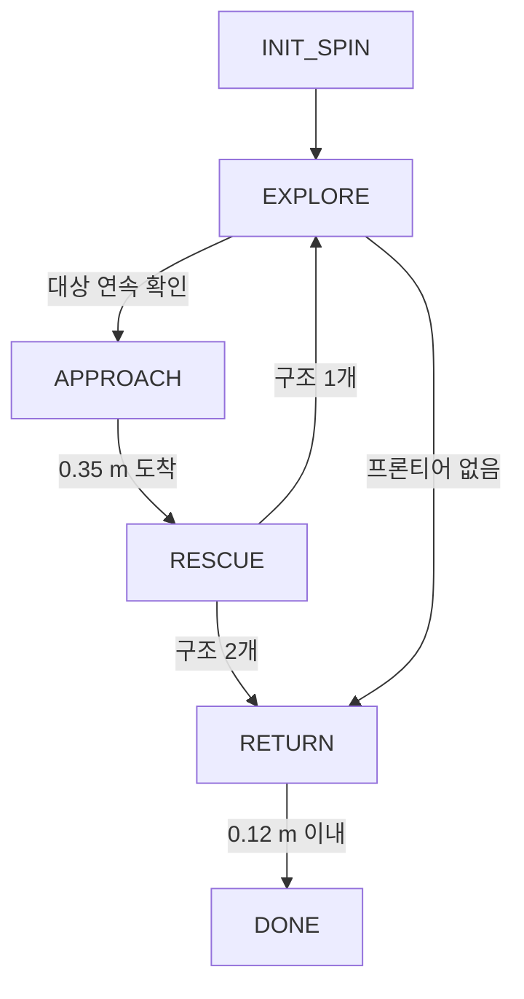

# SAR 해커톤 과제와 구현 기준

PNU TECH WEEK 2026 Search & Rescue 해커톤의 확정 과제, 평가 기준, 제출물 요건, 역할 분담, 팀 구현 기준을 정리한 문서입니다. 기존 팀 규칙 파일 [CONTEXT.md](../../CONTEXT.md)에 대회 공지 내용을 반영했습니다. 코드 구조, 모듈 인터페이스, Python 버전은 `CONTEXT.md`가 기준입니다(2026-09-30 결정). sar-robot의 현재 코드·문서와 다른 항목은 7.3절에 있습니다. AI 대화에 첨부하는 `CONTEXT.md`와 이 문서는 같은 내용을 유지하십시오.

## 1. 과제 정의

### 1.1 확정 목표

- 빨간 사과 2개를 모두 찾아 각 사과 앞까지 이동한 뒤 시작 지점으로 복귀함
- 정적 장애물, 이동하는 사람과 충돌 금지
- 지도 시각화 권장

### 1.2 운영 조건

| 조건 | 내용 |
|---|---|
| 지도 | 사전 제공 없음 |
| 로봇 현재 위치 | 제공 안 됨. GPS, `Supervisor`, `getSelf()` 사용 금지 |
| 시작 위치·방향 | 제공됨. `config.py`에 입력 |
| 대상 | 빨간 사과 2개. 위치 모름 |
| 목적지 | 시작 지점 |
| 방해 요소 | 다른 색 사과, 식탁 위 과일 모델, 공, 캔, 이동하는 보행자 |

### 1.3 초기 CONTEXT.md 대비 변경 사항

| 항목 | 초기 CONTEXT.md | 확정 내용 | 반영 |
|---|---|---|---|
| 대상 개수 | 미확정 (`TARGET_COUNT = 1`) | 빨간 사과 2개 | `TARGET_COUNT = 2` |
| 목적지 | 미확정 (대상 위치 또는 별도 좌표) | 시작 지점 복귀 | `GOAL_XY = None`, GO_GOAL 상태 미사용 |
| 같은 색 대상 | 고려 안 함 | 같은 색 2개 | 구조 완료 위치 주변 검출 제외 (8.2절) |
| 지도 시각화 | 디버깅·발표용 | 공지 권장 사항 | 지도 이미지 저장을 필수 기능으로 변경 |
| 제출물 | 정의 없음 | 컨트롤러, Python 파일, README | 3장 요건 추가 |

## 2. 평가 기준과 대응

공지 원문은 "완전성, 창의성, 확장성(코드로 구현, 글로 구현)"입니다. 이 문서는 괄호 내용을 코드 구현과 README 설명이 모두 평가 대상이라는 뜻으로 해석합니다. 해석은 주최측에 확인하십시오.

| 기준 | 팀 대응 | 증빙 자료 |
|---|---|---|
| 완전성 | 사과 2개 방문 후 시작 지점 복귀 완주. 타임아웃·정체 복구·강제 복귀로 부분 점수 확보 | 시연 영상, 상태 전환 로그, 최종 지도 이미지 |
| 창의성 | 재난 상황별 행동 규칙 (12장). 코드 구현 1~2개와 README 설명 | 설정값으로 켜고 끄는 시나리오 모드, README 창의성 절 |
| 확장성 | 대상 색·개수·시작 위치를 `config.py`로 변경. Webots 접근을 `RobotIO` 1곳으로 제한 | README 확장성 절, 모듈 구조도 |

## 3. 제출물

| 제출물 | 내용 | 주의 사항 |
|---|---|---|
| 컨트롤러 | `controllers/sar_main/` 폴더 | 월드 파일 로봇의 `controller` 필드를 `sar_main`으로 지정 |
| Python 파일 | `controllers/sar_main/sar/` 모듈 전체 | 모든 모듈을 컨트롤러 폴더 안에 배치 (7.1절) |
| README | 평가 환경에서 그대로 시연할 수 있는 전체 절차 | 평가 비중이 큰 제출물 |

### 3.1 README 필수 항목

| 항목 | 작성 내용 |
|---|---|
| 실행 환경 | OS, Webots R2025a, Python 3.10, 패키지 버전 |
| 설치 | 가상환경 생성과 패키지 설치 명령. 복사해 그대로 실행 가능한 형태 |
| YOLO 가중치 | `models/YOLO/yolo11n.pt` 위치와 파일이 없을 때 받는 방법 |
| 실행 | 월드 파일 열기, 로봇 `controller` 필드를 `sar_main`으로 지정, 시뮬레이션 시작 |
| 설정 변경 | 시작 위치·방향, 대상 색·개수, 제한 시간의 `config.py` 항목명 |
| 결과 확인 | 상태 전환 로그 예시, 지도 이미지 저장 경로 |
| 동작 원리 | 상태 머신, 지도 작성, 탐색, 인식, 복귀 방식 |
| 창의성·확장성 | 재난 시나리오 대응 방식과 확장 방법 |
| 문제 해결 | 자주 발생하는 오류와 조치 (YOLO 로드 실패, 시뮬레이션 속도 저하, 에셋 다운로드 오류) |
| 제한 사항 | 확인한 한계와 미구현 항목 |

### 3.2 README 재현성 검증

제출 1시간 전까지 다음 순서로 확인하십시오.

1. README를 작성하지 않은 팀원 1명이 개발 PC가 아닌 PC에서 저장소를 새로 받으십시오.
2. README 명령만 순서대로 실행해 시연을 끝까지 수행하십시오. README 외의 설명은 제공하지 마십시오.
3. 실패한 단계, 추가로 필요했던 명령, 절대 경로 사용 여부를 기록하십시오.
4. 기록한 항목을 README에 반영하고 1~2단계를 다시 수행하십시오.

## 4. 역할 분담

| 역할 | 담당자 | 백업 짝 |
|---|---|---|
| 인지 (C) | 이온규 | 김규민 |
| 계획 (B) | 박상원 | 김태훈 |
| 행동 (D) | 김규민 | 이온규 |
| 통합 (A) | 김태훈 | 박상원 |

역할별 담당 모듈과 과제 산출물은 다음과 같습니다.

- **인지**: `perception.py`, `viz.py`, `hsv_tuner`. 빨간 사과 검출·오탐 방지, 대상 월드 좌표, 지도 시각화 이미지
- **계획**: `grid_map.py`, `planner.py`. 점유 격자 지도, 프론티어 탐색, A\* 경로, 복귀 경로
- **행동**: `odometry.py`, `local_control.py`. 위치 추정, 경로 추종, 안전 필터, 성능 측정, 시연 영상
- **통합**: `robot_io.py`, `mission.py`, `config.py`, 컨트롤러. 상태 머신, 모듈 통합, README, 제출 패키지

배정 기준과 운영 규칙은 다음과 같습니다.

- 김태훈은 저장소 구성과 PR 통합을 진행 중이므로 통합으로 배정했습니다. 나머지 3명은 요청 순서대로 인지, 계획, 행동에 배정했습니다.
- 담당자가 작업을 진행하지 못하면 백업 짝이 인수합니다.
- 담당자와 GitHub 계정의 원본은 [역할과 담당 범위](team/roles.md)입니다. 배정을 바꾸면 두 문서를 같은 PR에서 수정하십시오.

## 5. 실행 환경과 연습 맵

### 5.1 실행 환경

| 항목 | 값 |
|---|---|
| 시뮬레이터 | Webots R2025a, `basicTimeStep` 64 ms |
| Python | 3.10 |
| 패키지 | numpy 1.23.5, opencv-python 4.8.0.74, matplotlib 3.7.5 |
| YOLO | YOLO11n 필수. torch 2.8.0, torchvision 0.23.0, ultralytics, 가중치 `models/YOLO/yolo11n.pt` |
| 컨트롤러 위치 | `controllers/<이름>/<이름>.py`. 월드 로봇의 `controller` 필드에 이름 지정 |

설치 절차의 원본은 sar-robot [개발 환경 준비](https://github.com/Tech-Week-2026-KimEPark/sar-robot/blob/main/docs/human/how-to/dev-setup.md)입니다.

### 5.2 연습 맵 apartment.wbt

| 항목 | 값 |
|---|---|
| 크기 | 약 12.4 × 13.1 m (x: −12.4 ~ 0, y: −13.1 ~ 0). 벽·창문·문으로 구분된 방 여러 개 |
| 로봇 시작 | (−0.3, −7.5), 방향 π (서쪽). 동쪽 벽 문 앞 |
| 바닥 사과 (z = 0.05) | 빨강 2, 초록 2, 보라 2, 주황 1 |
| 빨간 사과 위치 | (−12.02, −3.02), (−5.34, −10.54). 두 사과 사이 거리 약 10.1 m |
| 방해 요소 | 식탁 위 Apple 모델 2개 (z ≈ 0.83), Orange 모델, 축구공, 캔·맥주병, 고양이, 소 모형 |
| 보행자 | 1명. 0.2 m/s로 복도와 방 사이를 정해진 경로로 왕복 |
| 로봇 컨트롤러 | 기본값 `tb3_teleop`. `sar_main`으로 변경 필요 |

빨간 사과 좌표는 인식 결과의 위치 오차를 확인하는 용도입니다. 코드에 좌표를 직접 입력하지 마십시오. 사과 좌표와 로봇 정의는 2026-09-30 sar-robot `chore/intro-environment` 브랜치의 월드 파일에서 확인했습니다.

### 5.3 로봇 장치 (TurtleBot3 Burger)

| 장치 이름 | 사용법 | 비고 |
|---|---|---|
| `left wheel motor`, `right wheel motor` | `setPosition(float("inf"))` 후 `setVelocity(rad/s)` | 최대 약 6.67 rad/s (0.22 m/s) |
| `left wheel sensor`, `right wheel sensor` | `motor.getPositionSensor()` → `enable(ts)` → `getValue()` | 누적 회전각 [rad] |
| `LDS-01` | `enable(ts)` → `getRangeImage()` | 360개, 범위 0.12 ~ 3.5 m, 반사 없으면 `inf` |
| `camera` | `enable(ts)` → `getImage()` | 640 × 480, 수평 화각 1.0472 rad (60°), BGRA 바이트 |
| `compass`, `gyro`, `accelerometer` | `enable(ts)` → `getValues()` | TurtleBot3Burger PROTO 기본 장치 |

IMU 3종은 월드의 `extensionSlot`이 아니라 PROTO 본체에 포함되어 있습니다. Webots R2025a PROTO 캐시 파일에서 확인했습니다. 대회 월드에서도 `getDevice()` 결과가 `None`인지 확인하십시오.

```python
WHEEL_RADIUS = 0.033      # m
WHEEL_SEPARATION = 0.160  # m
ROBOT_RADIUS = 0.105      # m
```

### 5.4 센서 사용 규칙

라이다 인덱스와 방향은 다음과 같습니다. 예제 `tb3_lidar.py`로 확인한 값입니다.

| 인덱스 | 0 | 90 | 180 | 270 |
|---|---|---|---|---|
| 방향 | 뒤 | 왼쪽 | 정면 | 오른쪽 |

인덱스 $i$의 로봇 좌표계 각도는 $\alpha_i = \pi - i \cdot 2\pi / 360$입니다.

카메라 이미지는 다음 코드로 BGR 배열로 변환합니다.

```python
frame = np.frombuffer(camera.getImage(), np.uint8).reshape((H, W, 4))
bgr = cv2.cvtColor(frame, cv2.COLOR_BGRA2BGR)
```

- 라이다는 로봇 위쪽 수평면 1개만 측정합니다. 사과(높이 약 0.1 m), 캔, 맥주병은 라이다에 검출되지 않습니다. 대상 거리는 카메라로 추정하십시오.
- `Supervisor`, `getSelf()`, GPS는 사용하지 마십시오. `tb3_ground_truth`는 오도메트리 오차 확인용으로만 사용합니다.

## 6. 좌표·계산식

모든 모듈은 다음 좌표·단위 규칙을 따릅니다.

| 항목 | 규칙 |
|---|---|
| 월드 좌표 | Webots 월드 좌표 $(x, y)$ [m]. 시작 위치로 초기화 |
| 방향 $\theta$ | [rad], 반시계 방향이 양수, 범위 $[-\pi, \pi]$. 각도 차이는 `atan2(sin, cos)`로 정리 |
| 로봇 좌표 | $+x$ 정면, $+y$ 왼쪽 |
| 격자 지도 | `grid[row][col]`, row ↔ y, col ↔ x, 해상도 0.05 m, 시작점 중심 32 m 정사각형(640 × 640칸) |
| 격자 값 | 내부는 log-odds. 외부 공개값은 −1 모름, 0 빈칸, 1 장애물 |
| 속도 명령 | $(v, \omega)$ [m/s, rad/s] |
| 시간 | `robot.getTime()` 시뮬레이션 시간. 모든 타임아웃에 적용 |

**바퀴 속도 변환**

속도 명령 $(v, \omega)$를 바퀴 각속도로 변환합니다. $L$은 바퀴 간격, $R$은 바퀴 반지름입니다. 최대값을 초과하면 두 값의 비율을 유지하며 축소하십시오.

$$
\omega_l = \frac{v - \omega L / 2}{R}, \qquad \omega_r = \frac{v + \omega L / 2}{R}
$$

**카메라 초점거리·방위각·거리**

$W$는 이미지 폭, $\phi_h$는 수평 화각, $c_x$는 대상 중심의 가로 좌표, $D$는 사과 지름(약 0.095 m), $w$는 바운딩 박스 폭 [px]입니다. 색 분할로 찾은 경우 $w$는 외접원 지름입니다.

$$
f = \frac{W / 2}{\tan(\phi_h / 2)} \approx 554.3\ \text{px}, \qquad
\beta = -\arctan\frac{c_x - W/2}{f}, \qquad
d \approx \frac{f D}{w}
$$

$\beta$는 왼쪽이 양수입니다. 거리 3 m의 사과는 폭 약 17.6 px로 보입니다.

**대상 월드 좌표**

$$
(x_t,\ y_t) = \bigl(x + d\cos(\theta + \beta),\ y + d\sin(\theta + \beta)\bigr)
$$

**점유 격자 log-odds**

각 칸은 점유 확률 $p$ 대신 log-odds $l$을 저장합니다. 라이다가 맞은 칸에는 $L_{\text{occ}}$, 빔이 지나간 칸에는 $L_{\text{free}}$를 더하고 $[L_{\min}, L_{\max}]$ 범위로 제한합니다.

$$
l = \ln\frac{p}{1 - p}, \qquad
l \leftarrow \operatorname{clip}\left(l + L_{\text{occ/free}},\ L_{\min},\ L_{\max}\right)
$$

사람이 지나간 칸은 $(L_{\max} - l_{\text{th}}) / \lvert L_{\text{free}} \rvert = (3.5 - 0.3) / 0.4 = 8$회 갱신 뒤 빈칸이 됩니다. 매 스텝(64 ms) 갱신하면 약 0.5초입니다.

**방향 칼만 필터**

예측 단계는 엔코더 회전량 $\Delta\theta_{\text{enc}}$, 갱신 단계는 나침반 방향 $z$를 사용합니다.

$$
\begin{aligned}
\theta^- &= \theta + \Delta\theta_{\text{enc}}, & P^- &= P + Q \\
K &= \frac{P^-}{P^- + R}, & \theta &= \theta^- + K\, \operatorname{wrap}(z - \theta^-), \qquad P = (1 - K) P^-
\end{aligned}
$$

$\operatorname{wrap}$은 `atan2(sin, cos)`로 각도 차이를 정리하는 함수입니다.

**대상 위치 확정 가중 평균**

관측 $k$의 추정 위치를 $\mathbf{p}_k$, 거리를 $d_k$라고 하면 가까이서 본 관측에 큰 가중치를 줍니다.

$$
w_k = \frac{1}{\max(d_k,\ 0.3)^2}, \qquad
\hat{\mathbf{p}} = \frac{\sum_k w_k \mathbf{p}_k}{\sum_k w_k}
$$

## 7. 모듈 구성

### 7.1 파일 구조와 담당

```text
controllers/sar_main/
  sar_main.py            진입점: RobotIO 생성, Mission 루프
  sar/config.py          모든 설정값
  sar/robot_io.py        Webots 장치 래핑. Webots API는 이 파일에서만 호출
  sar/mission.py         상태 머신
  sar/grid_map.py        점유 격자, 라이다 갱신, 팽창, 프론티어
  sar/planner.py         A*, 프론티어 목표 선택
  sar/perception.py      YOLO11n 검출과 색 판별, 거리·방위 추정, 연속 확인
  sar/odometry.py        엔코더 오도메트리, 방향 칼만 필터, (선택) 스캔-지도 매칭
  sar/local_control.py   pure pursuit, 라이다 안전 필터
  sar/viz.py             지도·경로·대상 위치 그림 저장
controllers/hsv_tuner/
  hsv_tuner.py           키보드 조종, HSV 트랙바, 프레임 저장
```

파일별 담당은 4장에 있습니다. 모든 팀 모듈이 `controllers/sar_main/` 안에 있으므로 컨트롤러 폴더 단위로 제출할 수 있습니다. YOLO 가중치는 저장소 루트의 `models/YOLO/`에 있으므로 제출 형태에 맞춰 `YOLO_MODEL` 경로를 확인하십시오. 파일 1개는 담당자 1명만 수정합니다. main 머지는 통합 담당만 수행합니다.

### 7.2 모듈 인터페이스

모듈 사이 호출은 다음 함수로 제한합니다. 인터페이스를 바꾸려면 사용하는 모듈 담당자와 먼저 합의하고 이 절과 `CONTEXT.md`를 같은 PR에서 갱신하십시오.

```python
# robot_io.py
class RobotIO:
    def step(self) -> bool                         # robot.step(ts) != -1
    def time(self) -> float
    def encoders(self) -> tuple[float, float]      # (좌, 우) 누적 rad
    def compass(self) -> tuple | None              # 장치 없으면 None
    def lidar(self) -> list[float] | None          # 360개, 인덱스 규칙은 5.4절
    def camera_bgr(self) -> "np.ndarray | None"    # (480, 640, 3) uint8
    def drive(self, v: float, w: float) -> None    # 바퀴 속도 변환·제한 포함

# odometry.py
class Odometry:
    def __init__(self, x: float, y: float, theta: float)
    def update(self, enc_l: float, enc_r: float, compass=None) -> None
    # 방향 칼만 필터: 예측(엔코더 dθ, P += Q) → 갱신(나침반 z, K = P/(P+R))
    def pose(self) -> tuple[float, float, float]
    def heading_var(self) -> float                 # 방향 분산 P (디버깅·발표용)
    def correct(self, dx: float, dy: float, dth: float) -> None   # (선택) 스캔 매칭 보정값 적용

# grid_map.py
class GridMap:
    def update(self, pose, ranges) -> None
    def to_cell(self, x, y) -> tuple[int, int]     # (row, col)
    def to_world(self, row, col) -> tuple[float, float]
    def layers(self) -> tuple                      # (occ, blocked, soft, unknown) bool 배열
    def frontiers(self) -> list                    # [(크기, [(row, col), ...]), ...]
    def public(self) -> np.ndarray                 # 공개값 격자 (-1/0/1). viz.render_map() 입력
    def clearance(self) -> np.ndarray              # 가장 가까운 장애물까지 거리 [m]

# planner.py
def plan(grid, start_xy, goal_xy, allow_unknown=False, field=None) -> list[tuple] | None   # [(x, y), ...]
def choose_frontier(grid, pose, blacklist) -> tuple | None                     # (x, y)
class DistanceField:                               # 기준점 다익스트라 거리 지도
    def __init__(self, grid, origin_xy)
    def distance(self, xy) -> float | None         # 기준점까지 경로 비용 [m]
    def path(self, xy) -> list[tuple] | None       # xy → 기준점 경로

# local_control.py
def pure_pursuit(pose, path, lookahead) -> tuple[float, float, bool]   # (v, w, reached)
def safety_filter(v, w, ranges) -> tuple[float, float, bool]           # (v, w, blocked)

# perception.py
class TargetDetector:
    def __init__(self, color: str, model_path: str)   # YOLO 모델은 생성 시 1회만 로드
    def detect(self, bgr) -> dict | None
    # 반환: {"cx", "cy", "w", "h", "conf", "cls", "color", "dist", "bearing", "source"}
    #   source: "yolo" 또는 "color" (YOLO가 놓쳐 색 분할로 찾은 경우)
    def to_world(self, det, pose) -> tuple[float, float]
class Confirm:
    def update(self, seen: bool, xy, dist: float = None) -> tuple[bool, tuple | None]   # (확정 여부, 위치 추정)
    # 위치 추정 = 거리 가중 평균 (6장)

# mission.py
class Mission:
    def tick(self) -> None
    # 매 스텝 1회: 센서 → 오도메트리 → 지도 → 인식 → 상태 머신 → 안전 필터 → drive
```

### 7.3 sar-robot 반영 상태

sar-robot 코드와 문서는 이 문서 기준으로 변경했습니다. 모듈별 구현 상태는 sar-robot [모듈 인터페이스](https://github.com/Tech-Week-2026-KimEPark/sar-robot/blob/main/docs/human/reference/interfaces.md)에 있습니다.

| 항목 | 반영 내용 | 반영 PR |
|---|---|---|
| Python 버전 | 3.10 | sar-robot [#3](https://github.com/Tech-Week-2026-KimEPark/sar-robot/pull/3) |
| 코드 위치, 컨트롤러 이름 | `controllers/sar_main/sar/`, `sar_main`. `pip install -e .` 단계 제거 | sar-robot [#5](https://github.com/Tech-Week-2026-KimEPark/sar-robot/pull/5) |
| `RobotIO` | `step`, `time`, `encoders`, `compass`, `lidar`, `camera_bgr`, `drive(v, w)` | sar-robot #5 |
| 오도메트리 | `Odometry(x, y, theta)`, 방향 칼만 필터 | sar-robot #5 |
| 방향 범위 | `atan2(sin, cos)`로 $[-\pi, \pi]$ 정리 | sar-robot #5 |
| 설정값 | 10장 설정값 전체. `GRID_RESOLUTION` → `MAP_RES` | sar-robot #5 |

`grid_map.py`와 `planner.py`의 동작과 검증 결과는 [grid_map 기능 설명](../explanation/features/grid_map.md)과 [planner 기능 설명](../explanation/features/planner.md)에 있습니다. `public()`, `clearance()`, `DistanceField`, `plan()`의 `field` 인자는 기존 형식을 유지한 추가 인터페이스입니다. `mission.py`는 아직 구현 전입니다. 담당자는 7.2절 형식으로 구현하십시오.

## 8. 상태 머신



| 상태 | 동작 | 다음 상태 조건 |
|---|---|---|
| INIT_SPIN | 제자리 360° 회전. 주변 지도 작성, 나침반 부호·오프셋 보정 | 1회전 완료 → EXPLORE |
| EXPLORE | 프론티어 탐색. 이미 본 미구조 후보가 있으면 후보로 이동 | 대상 연속 확인 → APPROACH, 프론티어 없음 → RETURN |
| APPROACH | 대상 앞 0.35 m까지 이동 후 정면 정렬 | 도착 → RESCUE |
| RESCUE | 2초 정지, 위치·시각 기록, 지도 이미지 저장 | 구조 수 < 2 → EXPLORE, 구조 수 = 2 → RETURN |
| RETURN | 시작점으로 이동. 모르는 칸 통과 허용 | 0.12 m 이내 → DONE |
| DONE | 정지, 최종 지도 저장, 결과 출력 | 없음 |

### 8.1 공통 안전 규칙

- 남은 시간이 `RETURN_RESERVE` 미만이면 즉시 RETURN
- 4초 동안 이동 거리 5 cm 미만이면 RECOVERY (후진, 넓은 쪽으로 회전, 재계획)
- 안전 필터가 3초 이상 전진을 차단하면 재계획
- 프론티어 목표에 30초 안에 도달하지 못하면 블랙리스트 등록

### 8.2 대상 2개 처리 규칙

- 구조 완료 위치에서 `FOUND_EXCLUDE_RADIUS` 이내로 추정된 검출은 무시함. 같은 사과를 두 번 구조하는 오류 방지
- 탐색·접근 중 확인한 두 번째 사과 위치는 후보로 저장함. RESCUE 후 후보가 있으면 프론티어 탐색 없이 후보로 이동
- 한 화면에 빨간 사과가 2개 보이면 가까운 사과부터 접근
- 구조 순서, 위치, 시각을 로그와 지도 이미지에 표시

`FOUND_EXCLUDE_RADIUS`는 두 사과의 최소 간격보다 작아야 합니다. 연습 맵의 간격은 약 10.1 m입니다. 대회 맵에서 두 사과가 가까우면 값을 줄이십시오.

## 9. 설계 결정

| 항목 | 결정 | 이유 |
|---|---|---|
| 위치 추정 | 엔코더 오도메트리와 방향 1차원 칼만 필터 (예측: 엔코더, 갱신: 나침반) | 시작 위치를 알면 오도메트리로 추정 가능. 위치 오차의 주원인이 방향 오차 |
| 스캔-지도 매칭 도입 기준 | `tb3_ground_truth` 월드 1바퀴 주행 후 위치 오차 0.3 m 이상이면 도입 | 잘못된 매칭은 지도를 손상시킴. 필요성을 수치로 판단 |
| 스캔-지도 매칭 방식 | 1~2초마다 ±0.1 m, ±3° 범위 격자 탐색. 점수 향상이 충분할 때만 `correct()` 적용 | ICP보다 구현이 단순하고 실패 시 영향 범위가 작음 |
| 파티클 필터 (MCL/AMCL) | 사용 안 함 | 대회 시간 안에 구현·튜닝 불가 |
| 나침반 보정 | 시작 회전 중 엔코더 방향과 비교해 부호·오프셋 자동 추정 | 예제마다 나침반 값 규약이 달라 수동 설정 시 오류 위험 |
| 대상 인식 | YOLO11n 후보 검출 후 상자 안 HSV 색 비율로 대상 색 판별 | YOLO 사용이 대회 방침. 연습 맵에 색만 다른 사과가 섞여 있음 |
| YOLO 클래스 | 47 apple, 49 orange, 32 sports ball | 다른 색 사과가 apple 외 클래스로 검출될 수 있음 |
| YOLO 보완 | YOLO 미검출 시 같은 프레임에서 색 분할(원형도·면적 조건)로 대체 검출 | 먼 거리의 작은 사과, COCO 학습 분포와 다른 색 |
| YOLO 실행 주기 | 4스텝(약 0.26초)마다 1회, `verbose=False` | CPU 추론 시간만큼 시뮬레이션이 느려짐 |
| 오탐 방지 | 원형도, 최소 면적, 화면 가운데선보다 확실히 위인 덩어리 제외, 4프레임 연속 확인 | 식탁 위 과일, 주황빛 바닥 |
| 대상 거리 | 바운딩 박스 폭으로 추정 (6장) | 사과가 라이다에 검출되지 않음 |
| 대상 위치 추정 | 거리 가중 평균 (6장) | 카메라 거리 추정은 가까울수록 정확 |
| 같은 색 대상 2개 | 구조 완료 위치 주변 검출 제외, 미구조 후보 저장 (8.2절) | 같은 사과 재구조 방지, 두 번째 사과 탐색 시간 단축 |
| 사람 회피 | 전역 경로(A\*)는 지도 기준, 매 스텝 라이다 안전 필터가 최종 속도 결정 | 지도에 없는 이동 장애물 |
| 지도 | 베이지안 점유 격자 (log-odds) | 강의 Bayesian Filter를 로그 공간 덧셈으로 구현. 상·하한 고정으로 사람 흔적 제거 |
| 경로 | A\* 8방향, 팽창 반경 = 로봇 반지름 + 0.07 m, 벽 근처 추가 비용 | 통로 가운데 주행 |
| 경로 추종 | pure pursuit, look-ahead 0.35 m, 55° 이상 틀어지면 제자리 회전 | 강의 방식과 동일 |
| 지도 시각화 | 5초 주기와 RESCUE·DONE 시점에 PNG 저장. 격자, 주행 궤적, 계획 경로, 구조 위치, 시작점 표시 | 공지 권장 사항. 시연·README 증빙 자료 |

## 10. 기본 설정값

구현 전 기준값입니다. 구현 후 현재 값의 원본은 sar-robot의 `config.py`입니다. 대회 공지로 바뀐 값과 추가 항목에는 주석을 달았습니다.

```python
START_X, START_Y, START_THETA = -0.3, -7.5, math.pi   # 대회 당일 입력
TARGET_COLOR = "red"          # red | green | purple | orange | custom
TARGET_COUNT = 2              # 대회 공지: 빨간 사과 2개
GOAL_XY = None                # 대회 공지: 목적지는 시작 지점
TIME_LIMIT = 900.0            # s, 시뮬레이션 시간. 대회 공지 확인 후 수정
RETURN_RESERVE = 150.0        # s

V_MAX = 0.18                  # m/s
V_APPROACH = 0.10             # m/s
W_MAX = 1.8                   # rad/s
LOOKAHEAD = 0.35              # m
GOAL_TOL = 0.15               # m
SAFETY_MARGIN = 0.06          # m, 몸체 바깥 여유
STOP_DIST = 0.20              # m, 정면 즉시 정지 거리

MAP_RES = 0.05                # m
L_OCC = 0.9                   # 맞은 칸 log-odds 증분 (확률 약 0.71)
L_FREE = -0.4                 # 지나간 칸 log-odds 증분 (확률 약 0.40)
L_MIN, L_MAX = -2.0, 3.5      # 확률 약 0.12 ~ 0.97에서 고정
OCC_THRESHOLD = 0.3           # 이보다 크면 장애물 (확률 약 0.57)

HEADING_Q = 0.01 ** 2         # 방향 예측 잡음 (한 스텝, rad^2)
HEADING_R = 0.05 ** 2         # 나침반 관측 잡음 (rad^2)
SCAN_MATCH = False            # 오차 0.3 m 이상 확인 시 True
SCAN_MATCH_PERIOD = 1.5       # s
LIDAR_MIN, LIDAR_MAX = 0.12, 3.5
INFLATE = ROBOT_RADIUS + 0.07
MIN_FRONTIER_CELLS = 6

CAMERA_FOV = 1.0472
YOLO_MODEL = "../../models/YOLO/yolo11n.pt"
YOLO_DEVICE = "cpu"           # NVIDIA GPU면 "cuda", Apple Silicon이면 "mps"
YOLO_CLASSES = [47, 49, 32]   # apple, orange, sports ball
YOLO_CONF = 0.20
YOLO_EVERY = 4                # 몇 스텝마다 추론
COLOR_RATIO_MIN = 0.25        # 상자 안 대상 색 픽셀 비율 하한
USE_COLOR_FALLBACK = True     # YOLO 미검출 시 색 분할로 대체
TARGET_DIAMETER = 0.095       # m
MIN_BLOB_AREA = 60            # px
CONFIRM_FRAMES = 4
APPROACH_DIST = 0.35          # m

FOUND_EXCLUDE_RADIUS = 0.6    # m, 추가: 구조 완료 위치 주변 검출 제외 반경
MAP_SAVE_DIR = "output"       # 추가: 지도 이미지 저장 폴더 (컨트롤러 폴더 기준)
MAP_SAVE_PERIOD = 5.0         # s, 추가: 지도 이미지 저장 주기
```

## 11. HSV 초기값

OpenCV 기준 범위(H 0~179, S·V 0~255)입니다. YOLO 상자 안 색 판별과 색 분할 대체 검출에 공통으로 사용합니다. 대회 현장 조명에서 `hsv_tuner`로 다시 조정하십시오.

| 색 | 범위 | 참고 |
|---|---|---|
| red | (0,120,60)~(8,255,255) ∪ (170,120,60)~(179,255,255) | baseColor 1 0 0 |
| orange | (12,170,120)~(28,255,255) | baseColor 1 0.73 0. 나무 바닥과 겹칠 수 있어 채도 하한을 높게 설정 |
| purple | (125,90,50)~(160,255,255) | baseColor 0.56 0 1 |
| green | (30,90,50)~(60,255,255) | 텍스처 사과. 현장 확인 필수 |

## 12. 창의성·확장성 제안

아래 항목은 팀 제안입니다. 구현 여부와 우선순위는 통합 담당이 결정합니다. 빨간 사과 2개를 요구조자 2명으로 보고 재난 상황별 로봇 행동을 정의합니다.

| 상황 | 로봇 행동 | 구현 방법 | 난이도 | 평가 대응 |
|---|---|---|---|---|
| 가스 누출·붕괴 위험 구역 | 위험 구역 진입 금지, 우회 경로 계획 | `config.py`의 `NO_GO_ZONES` 사각형 목록을 격자 장애물로 처리 | 쉬움 | 코드 |
| 다수 요구조자 | 발견 즉시 위치·시각 기록, 가까운 순서로 방문, 구조 보고서 출력 | 구조 목록을 CSV와 지도 이미지로 저장 | 쉬움 | 코드 |
| 대피 인원 이동 | 사람 접근 시 감속·정지, 통로 양보 | 안전 필터의 정지 거리와 속도 비율 조정 | 쉬움 | 코드 (기본 기능) |
| 통신 두절·배터리 제한 | 남은 시간 기준 강제 복귀, 작성한 지도로 복귀 경로 계산 | `RETURN_RESERVE`, RETURN의 모르는 칸 통과 허용 | 쉬움 | 코드 (기본 기능) |
| 지진 후 잔해로 통로 차단 | 지도 변화 반영, 차단된 경로 재계획, 차단 지점 보고 | log-odds 갱신, 경로 차단 시 재계획, 차단 위치 로그 | 보통 | 코드 일부, README |
| 화재·연기 | 카메라 인식 저하 시 라이다 위주 탐색, 고온 구역 비용 증가, 저속 주행 | 위험 구역 비용 레이어, 구역별 속도 제한 | 보통 | README |
| 여진 | 이상 가속도 감지 시 정지 후 재개 | `accelerometer` 값 임계 검사 | 보통 | README |

- 코드 구현은 `NO_GO_ZONES` 위험 구역 회피와 구조 보고서 출력 2개를 권장합니다. 설정값 1개로 켜고 끌 수 있어 기본 완주에 영향이 없습니다.
- 확장성은 README에 다음 내용을 설명하십시오. 대상 색·개수·시작 위치는 `config.py`만 수정하면 바뀝니다. 실제 로봇은 `RobotIO`만 교체하면 나머지 모듈을 재사용할 수 있습니다. YOLO 클래스를 바꾸면 사과 외 대상도 찾을 수 있습니다.

## 13. 코딩 규칙

- Python 3.10을 사용함. 외부 패키지는 numpy·opencv·ultralytics만 사용하며 scipy 없이 동작해야 함
- YOLO 모델은 컨트롤러 시작 시 1회만 로드함. 추론은 `model.predict(..., verbose=False)`로 로그 출력 억제
- Webots API는 `robot_io.py`에서만 호출함
- 숫자 상수는 `config.py`에만 정의함
- A\*·프론티어 선택 같은 무거운 계산은 목표 변경, 경로 차단, 2초 주기에만 실행함
- 모든 모듈에 Webots 없이 실행되는 `if __name__ == "__main__":` 단독 테스트를 포함함
- 센서 값이나 경로가 `None`일 때의 동작을 정의함. 예외로 종료하지 않음
- 모든 `while` 루프에 반복 상한이나 시간 제한을 둠
- 상태 전환 로그 형식은 `[t=12.3s] EXPLORE -> APPROACH (red at -5.34,-10.54)`로 통일함

이름 규칙과 코드 형식(ruff)은 sar-robot [코드 작성 규칙](https://github.com/Tech-Week-2026-KimEPark/sar-robot/blob/main/docs/human/reference/code-conventions.md)을 따릅니다. 폴더 구조와 Python 버전은 이 문서가 기준입니다.

## 14. 대회 시작 후 확인 항목

| 확인 항목 | 담당 | 결과 기록 위치 |
|---|---|---|
| 대회 맵과 apartment.wbt의 동일 여부 | 통합 | 이 문서 5.2절 |
| 시작 위치·방향 값 | 통합 | `config.py` |
| 제한 시간, 채점 세부 (시간 점수, 충돌 감점) | 통합 | 이 문서 2장 |
| 평가 기준 괄호 내용의 의미 | 통합 | 이 문서 2장 |
| 제출 형태 (저장소 전체 또는 컨트롤러 폴더), 평가 PC 사양 (OS, GPU, 인터넷) | 통합 | 이 문서 3장 |
| 사전 작성 코드, 스캔 매칭 허용 범위 | 통합 | 이 문서 9장 |
| YOLO 방침 (사전학습 가중치 그대로 사용, 추가 학습 허용 여부) | 인지 | 이 문서 9장 |
| 대회 월드 로봇의 `compass`, `gyro` 존재 여부 | 행동 | 이 문서 5.3절 |
| `tb3_ground_truth` 월드 오도메트리 위치 오차 (0:40까지) | 행동 | `SCAN_MATCH` |
| 색별 사과의 YOLO 클래스·신뢰도 (1 m, 2 m, 3 m 거리, 첫 20분) | 인지 | 이 문서 9장 |
| YOLO 추론 1회 시간. 느리면 `YOLO_EVERY` 증가 또는 `imgsz=480` | 인지 | `config.py` |

나침반이 없으면 칼만 필터 갱신 단계를 생략하십시오. 자이로가 있으면 예측 단계에 엔코더 대신 자이로를 사용하십시오.
